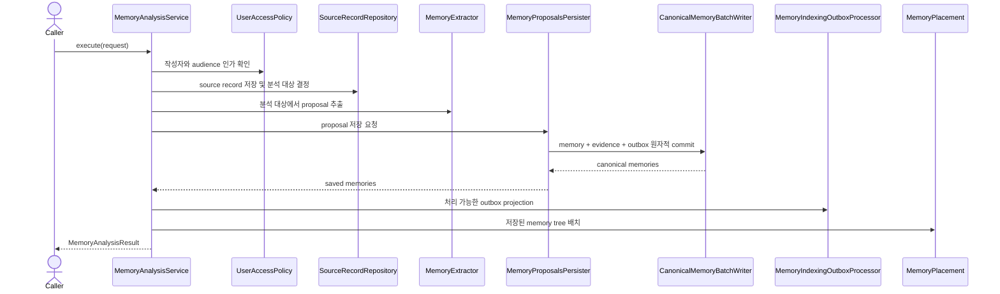
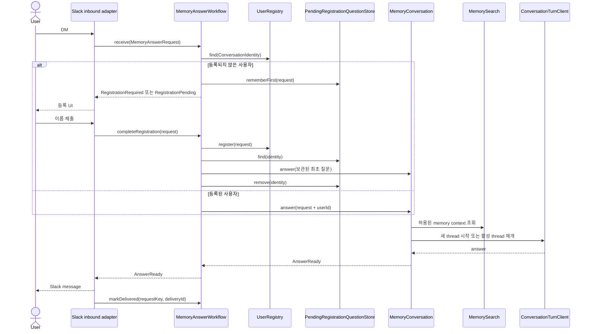

# Application use cases

이 디렉터리는 input port를 구현하고 domain 규칙과 output port를 조합하는 기술 중립적인
application orchestration을 담는다. HTTP, Slack, SQLite, Codex, Qdrant 같은 기술 이름과
payload 형식은 여기에서 직접 다루지 않는다.

## 패키지 지도

| 패키지 | 책임 | 상세 문서 |
|---|---|---|
| `identity` | conversation identity를 application user로 해석하고 등록·인가한다. | [identity](identity/README.md) |
| `memory/analysis` | source record를 분석해 canonical memory로 저장하고 후처리를 요청한다. | [analysis](memory/analysis/README.md) |
| `memory/answer` | 사용자 등록과 memory-backed answer의 채널 독립 workflow를 조정한다. | [answer](memory/answer/README.md) |
| `memory/conversation` | 질문 멱등성, 10분 세션 lease, context와 Codex turn을 관리한다. | [conversation](memory/conversation/README.md) |
| `memory/placement` | 새 memory를 기존 memory tree에 배치한다. | [placement](memory/placement/README.md) |
| `memory/search` | 사용자에게 보이는 memory만 semantic search한다. | [search](memory/search/README.md) |
| `memory/write` | proposal을 원자적으로 저장하고 indexing outbox를 처리한다. | [write](memory/write/README.md) |

## 전체 memory 쓰기 흐름

Canonical database commit까지가 요청 성공의 기준이다. Indexing과 tree placement는 commit 이후의
후처리이므로 실패하면 기록만 남기고 저장된 canonical memory를 되돌리지 않는다.

## 전체 Slack memory 응답 흐름

Slack은 application result를 UI로 표현할 뿐이며 사용자 registry, pending question, authorization,
idempotency와 session expiry를 소유하지 않는다.

## 문서 유지 규칙

- 실제 use case 구현이 있는 각 leaf package에는 `README.md`를 둔다.
- 각 README에는 최소 하나의 Mermaid `sequenceDiagram`으로 정상 흐름과 중요한 분기를 표현한다.
- input/output port나 호출 순서가 바뀌면 같은 변경에서 해당 README를 갱신한다.
- diagram participant에는 구현 기술보다 application 역할 또는 port 이름을 사용한다.
