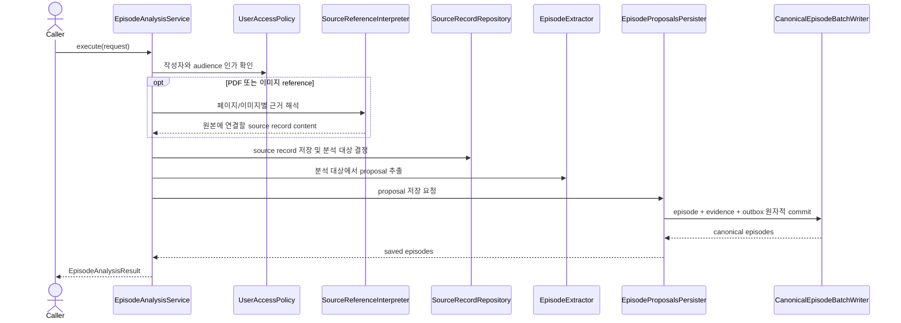
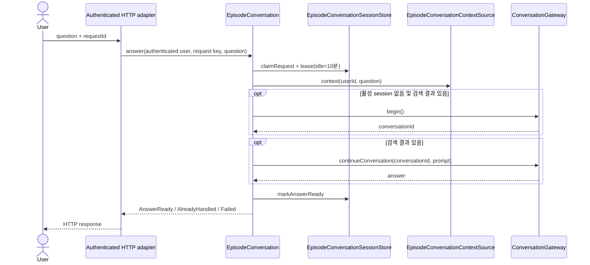

# Application use cases

이 디렉터리는 input port를 구현하고 domain 규칙과 output port를 조합하는 기술 중립적인
application orchestration을 담는다. HTTP, SQLite, Codex, Ollama 같은 기술 이름과
payload 형식은 여기에서 직접 다루지 않는다.

## 패키지 지도

| 패키지 | 책임 | 상세 문서 |
|---|---|---|
| `identity` | 사용자를 이름·비밀번호로 등록·로그인시키고, 목록을 제공하고 인가한다. | [identity](identity/README.md) |
| `group` | 저장된 Component를 Group에 배치·분할하고 원자 확정한다. 명시적 내부 호출 전용이다. | [group](memoryextraction/group/README.md) |
| `component` | Episode에서 장기 지식을 Component로 추출한 뒤 Group 정리까지 이어가고, 대화용 Component 검색을 읽을 수 있는 출처 Episode로 거른다. | [component](memoryextraction/component/README.md) |
| `episode/search` | 대화용으로 질문에 가까운, 사용자가 읽을 수 있는 Episode를 찾는다. | - |
| `episode/analysis` | source record를 분석해 canonical episode로 저장하고 후처리를 요청한다. | [analysis](memoryextraction/episode/README.md) |
| `episode/conversation` | 질문 멱등성, 10분 세션 lease, context와 provider conversation을 관리한다. | [conversation](chatservice/README.md) |
| `episode/write` | proposal을 원자적으로 저장하고 Component 할당 outbox를 같은 transaction으로 남긴다. | [write](episode/write/README.md) |

## 전체 episode 쓰기 흐름

```mermaid
sequenceDiagram
    actor Caller
    participant Analysis as EpisodeAnalysisService
    participant Access as UserAccessPolicy
    participant Reference as SourceReferenceInterpreter
    participant Sources as SourceRecordRepository
    participant Extractor as EpisodeExtractor
    participant Writer as EpisodeProposalsPersister
    participant DB as CanonicalEpisodeBatchWriter

    Caller->>Analysis: execute(request)
    Analysis->>Access: 작성자와 audience 인가 확인
    opt PDF 또는 이미지 reference
        Analysis->>Reference: 페이지/이미지별 근거 해석
        Reference-->>Analysis: 원본에 연결할 source record content
    end
    Analysis->>Sources: source record 저장 및 분석 대상 결정
    Analysis->>Extractor: 분석 대상에서 proposal 추출
    Analysis->>Writer: proposal 저장 요청
    Writer->>DB: episode + evidence + outbox 원자적 commit
    DB-->>Writer: canonical episodes
    Writer-->>Analysis: saved episodes
    Analysis-->>Caller: EpisodeAnalysisResult
```

Canonical database commit까지가 요청 성공의 기준이다. Component 배정은 commit에 함께 남긴 outbox를
worker가 이후에 처리하며, 실패해도 저장된 canonical episode를 되돌리지 않는다.

HTTP 지식 입력은 인증된 application userId로 `EpisodeAnalysis`를 직접 호출한다.

## HTTP episode 응답 흐름

```mermaid
sequenceDiagram
    actor User
    participant HTTP as Authenticated HTTP adapter
    participant Conversation as EpisodeConversation
    participant Sessions as EpisodeConversationSessionStore
    participant Context as EpisodeConversationContextSource
    participant Gateway as ConversationGateway

    User->>HTTP: question + requestId
    HTTP->>Conversation: answer(authenticated user, request key, question)
    Conversation->>Sessions: claimRequest + lease(idle=10분)
    Conversation->>Context: context(userId, question)
    opt 활성 session 없음 및 검색 결과 있음
        Conversation->>Gateway: begin()
        Gateway-->>Conversation: conversationId
    end
    opt 검색 결과 있음
        Conversation->>Gateway: continueConversation(conversationId, prompt)
        Gateway-->>Conversation: answer
    end
    Conversation->>Sessions: markAnswerReady
    Conversation-->>HTTP: AnswerReady / AlreadyHandled / Failed
    HTTP-->>User: HTTP response
```

사용자 목록과 application UserId는 공통 identity 기능이다. Slack 등록·최초 질문 재개·
명령과 DM 처리는 제거했다. HTTP 인증은 사람의 이름·비밀번호 로그인 세션 cookie와 기계의 Bearer API key를 받는다.
세션 격리, 동일 요청 답변 재사용, 10분 idle 만료는 `EpisodeConversation`이 관리한다.

## 문서 유지 규칙

- 실제 use case 구현이 있는 각 leaf package에는 `README.md`를 둔다.
- 각 README에는 최소 하나의 Mermaid `sequenceDiagram`으로 정상 흐름과 중요한 분기를 표현한다.
- input/output port나 호출 순서가 바뀌면 같은 변경에서 해당 README를 갱신한다.
- diagram participant에는 구현 기술보다 application 역할 또는 port 이름을 사용한다.
