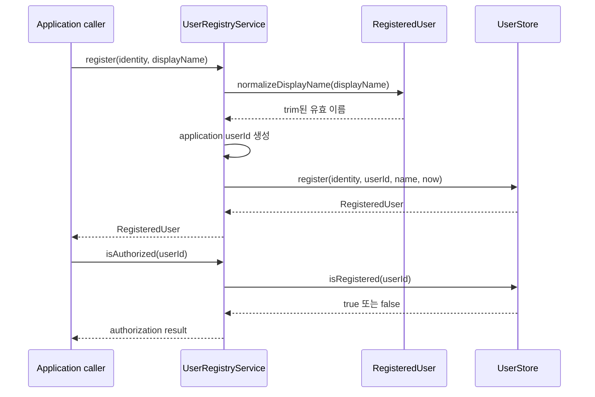

# Identity use case

`UserRegistryService`는 인증된 외부 conversation identity를 application `RegisteredUser`로
해석한다. 사용자 등록과 조회를 제공하는 `UserRegistry` input port이면서, 등록 여부를 판단하는
`UserAccessPolicy` 구현이기도 하다.

## 등록과 인가

## 규칙

- Slack ID 같은 외부 식별자는 `ConversationIdentity(scopeId, participantId)`로만 application에 들어온다.
- 표시 이름의 trim, 빈 값 금지, 50자 제한은 domain의 `RegisteredUser`가 소유한다.
- 외부 identity를 다시 등록해도 저장소가 기존 application `userId`를 보존한다.
- `reserveLegacy`는 환경 변수 기반 기존 mapping을 실제 이름 등록 전까지 예약하는 마이그레이션 경로다.
