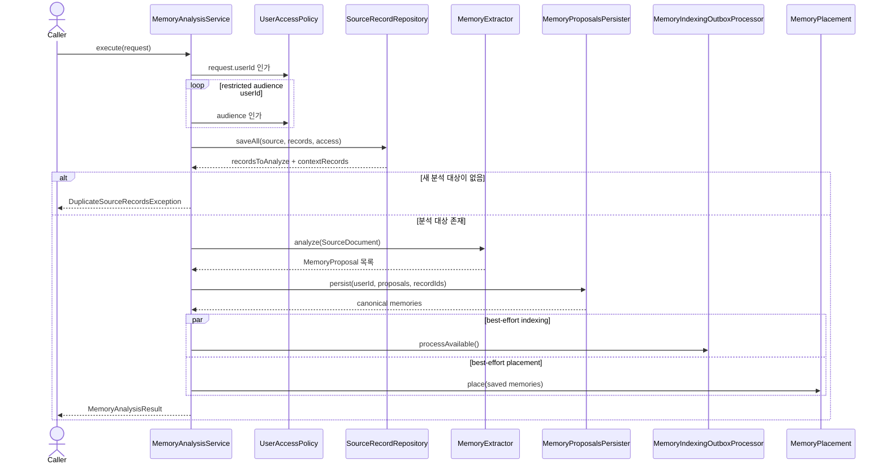

# Memory analysis use case

`MemoryAnalysisService`는 입력 source record를 저장하고, 새 분석 대상에서 memory proposal을 추출해
canonical memory로 즉시 확정한다. 별도의 preview/review 단계는 없다.

## 분석과 저장

## 실패 계약

- 등록되지 않은 작성자 또는 audience는 domain access exception/application audience exception으로 거절한다.
- 동일 source가 다른 access scope로 이미 저장돼 있으면 `ConflictingSourceAudienceException`으로 변환한다.
- source 저장, extraction, canonical commit 실패는 `MemoryAnalysisUnavailableException`으로 변환한다.
- indexing과 placement 실패는 canonical commit을 취소하지 않으며 후속 복구 대상으로 남긴다.
