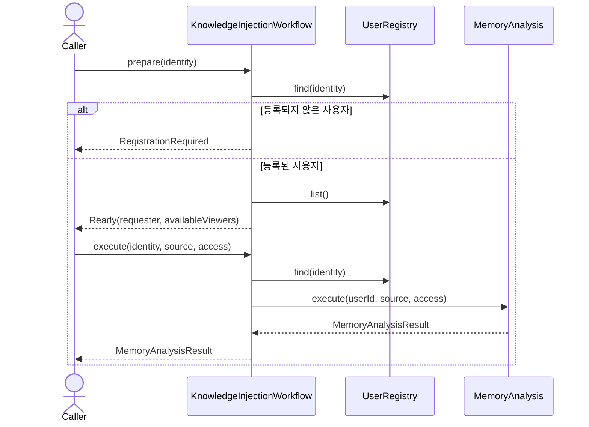
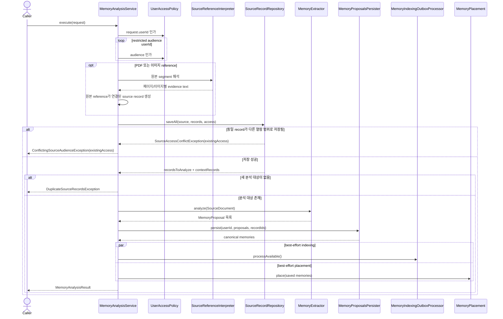

# Memory analysis use case

`MemoryAnalysisService`는 입력 source record를 저장하고, 새 분석 대상에서 memory proposal을 추출해
canonical memory로 즉시 확정한다. 별도의 preview/review 단계는 없다.

`KnowledgeInjectionWorkflowService`는 외부 채널의 인증된 conversation identity를 application user로
해석하고, 등록된 사용자에게만 같은 `MemoryAnalysis` 흐름을 제공한다.

## 채널 기반 지식 주입

## 분석과 저장

PDF·이미지 reference는 최대 20MB까지 받는다. PDF는 네 페이지 단위로 렌더링하고 이미지와 함께
추출 가능한 텍스트를 Codex에 제공하며, 이미지는 하나의 segment로 해석한다. 원본 binary는 SHA-256으로
중복 제거해 SQLite에 저장하고 각 해석 source record가 같은 reference를 가리킨다. 따라서 해석 record를
채택한 canonical memory evidence에서 원본 파일과 해당 segment 해석을 함께 추적할 수 있다. 원본과
해석 record는 요청에서 지정한 동일한 access scope를 상속한다.

## 실패 계약

- 등록되지 않은 작성자 또는 audience는 domain access exception/application audience exception으로 거절한다.
- 동일 source record가 다른 access scope로 이미 저장돼 있으면 기존 scope를 포함한
  `ConflictingSourceAudienceException`으로 변환하여 호출자가 정확한 재등록 방법을 안내할 수 있게 한다.
- source 저장, extraction, canonical commit 실패는 `MemoryAnalysisUnavailableException`으로 변환한다.
- 손상되었거나 지원하지 않는 reference는 `InvalidKnowledgeReferenceException`으로 변환한다.
- indexing과 placement 실패는 canonical commit을 취소하지 않으며 후속 복구 대상으로 남긴다.
- 채널 identity가 등록된 application user로 해석되지 않으면 지식 주입을 시작하거나 실행하지 않는다.
