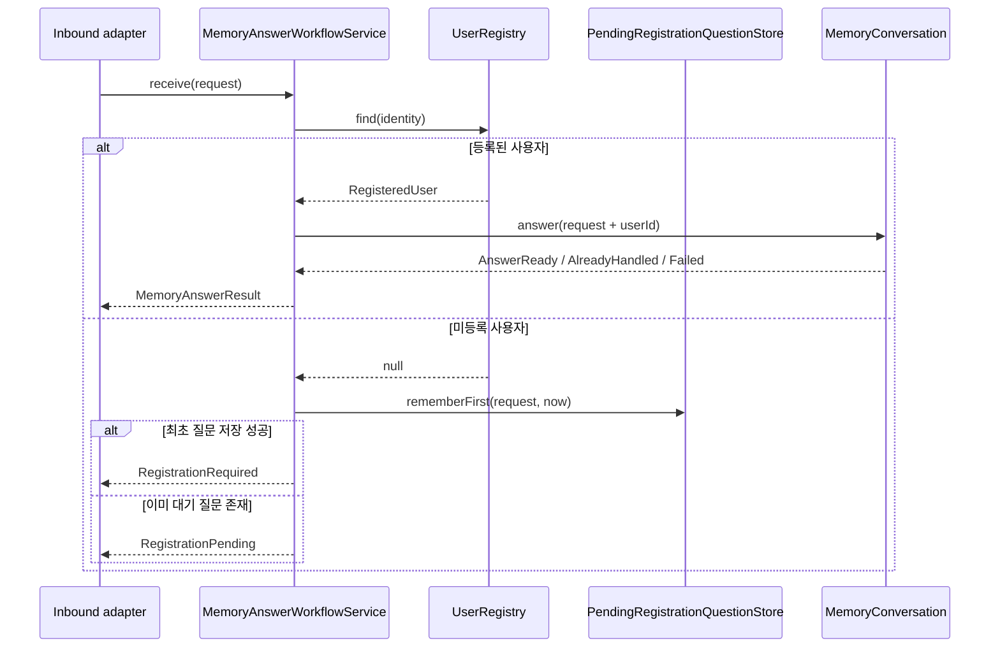
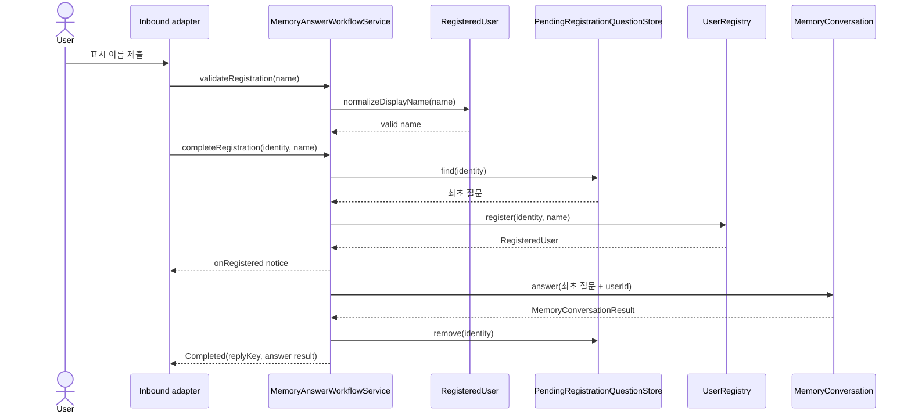
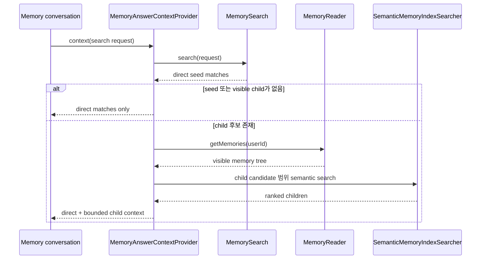

# Memory answer workflow

`MemoryAnswerWorkflowService`는 채널에 독립적인 사용자 등록 및 memory answer 진입점이다. Slack은
이 input port만 호출하며 `UserRegistry`, pending question, `MemoryConversation`을 직접 조합하지 않는다.

## 질문 접수

## 등록 완료와 최초 질문 재개

## Answer context 확장

`MemoryAnswerContextProvider`는 일반 semantic search 결과를 seed로 사용하고, 보이는 child memory만
제한적으로 재검색한다. 직접 검색 결과 자체는 바꾸지 않고 Codex reference context만 확장한다.

등록 안내 전송이 실패하면 inbound adapter가 `registrationPromptDeliveryFailed`를 호출한다. 동일한
pending key인 경우 저장 상태를 해제해 Slack 재전송 이벤트가 다시 등록 안내를 만들 수 있게 한다.
