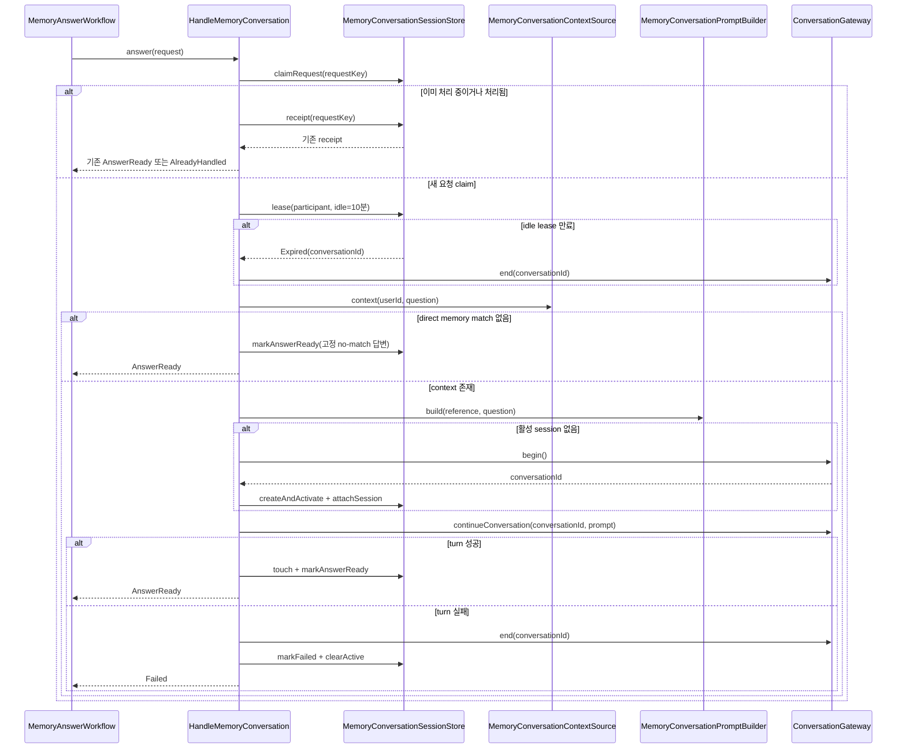
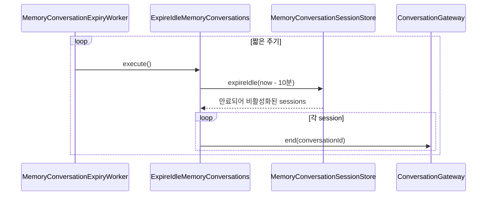
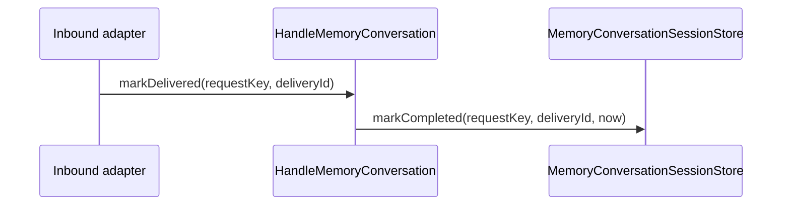

# Memory conversation use case

`HandleMemoryConversation`은 등록된 사용자의 질문 한 건을 memory context와 provider conversation으로
처리한다. 채널 사용자 등록은 다루지 않으며 request idempotency와 10분 idle session lease를 소유한다.

## 질문 처리와 session 선택

## Idle session 만료

## 전달 완료

## 규칙

- 활성 session은 scope, participant, application user ID가 모두 일치할 때만 임대한다.
- 10분 idle lease가 지난 conversation은 즉시 비활성화하고 provider 자원을 해제하며 다시 재개하지 않는다.
- 같은 request key는 다시 conversation provider에 보내지 않는다.
- answer를 만들었지만 채널 전송 전인 `ANSWER_READY`는 동일 이벤트 재처리 시 기존 answer를 반환한다.
- memory match가 없으면 conversation provider를 호출하지 않고 고정된 no-match 답변을 반환한다.
- prompt의 memory reference는 신뢰하지 않는 데이터로 감싸며 그 안의 지시를 실행하지 않는다.
- memory conversation use case는 session 상태에 따라 conversation 생성·재사용·종료 시점을 결정한다.
- `ConversationGateway.begin()`은 prompt 없이 ID를 만들고, 질문 prompt는
  `continueConversation(conversationId, prompt)`에만 전달한다.
- provider 실패 시 해당 conversation을 종료하고 active session과 request 처리를 실패 상태로 정리한다.
