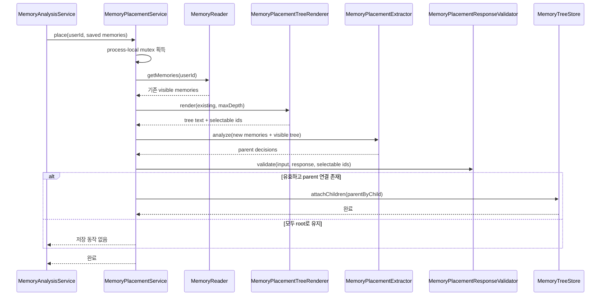

# Memory placement use case

`MemoryPlacementService`는 새로 저장된 memory batch를 기존 visible memory tree에 연결한다.
Extractor의 응답은 신뢰하지 않고 application에서 완전성, 참조 범위와 cycle을 검증한다.

## Memory 배치

## 검증 규칙

- 입력 memory마다 정확히 하나의 decision이 있어야 한다.
- decision memory ID는 중복되거나 입력 집합 밖에 있을 수 없다.
- 자기 자신, 노출되지 않은 기존 memory를 parent로 선택할 수 없다.
- 같은 batch 안의 parent 연결은 cycle을 만들 수 없다.
- `MemoryTreeBootstrapService`는 기존 flat root를 같은 `MemoryPlacement` input port로 한 번에 재배치한다.
