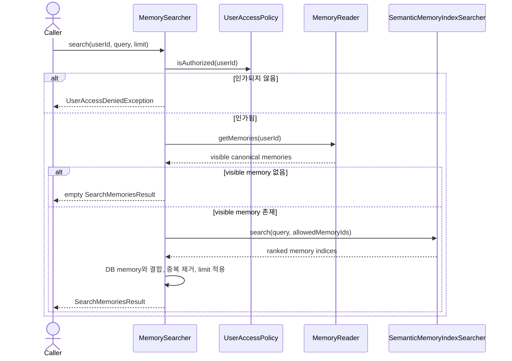

# Memory search use case

`MemorySearcher`는 application user의 접근 권한과 실제 visible memory 집합을 먼저 확정한 뒤,
그 ID 범위 안에서만 semantic index를 검색한다.

## 접근 제한 검색

## 규칙

- semantic index가 반환한 ID라도 `MemoryReader`가 사용자에게 노출하지 않으면 결과에서 제외한다.
- Qdrant 검색 scope에는 visible memory ID만 전달한다.
- adapter 또는 index 구현 실패는 input port의 `MemorySearchUnavailableException`으로 변환한다.
- query는 application에서 trim한 값을 검색과 결과에 사용한다.
