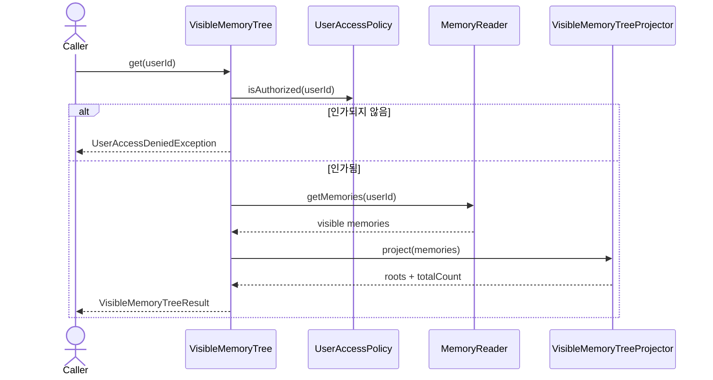

# Visible memory tree use case

`ViewVisibleMemoryTree`는 등록 사용자를 인가하고, 그 사용자에게 보이는 canonical memory만 읽어
읽기 전용 forest로 반환한다. HTTP, JSON과 HTML 표현은 이 package의 책임이 아니다.

## Projection 규칙

- visible 집합 밖의 child reference는 제외한다.
- visible parent가 없는 memory는 root로 표시한다.
- root와 sibling은 memory ID 순으로 고정한다.
- cycle과 다중 parent가 있는 legacy data도 각 memory를 최대 한 번만 표시한다.
- root에서 도달할 수 없는 component는 별도 root로 표시하며 저장 데이터를 수정하지 않는다.

응답은 화면에 필요한 subject, content, type, certainty, 생성 시각과 자식만 포함한다. 작성자,
allowed user 목록과 evidence reference는 이 조회 계약으로 노출하지 않는다.
