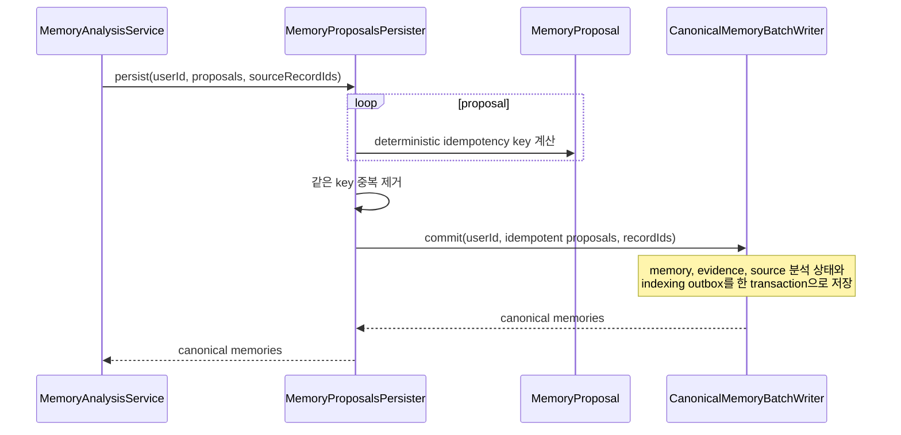
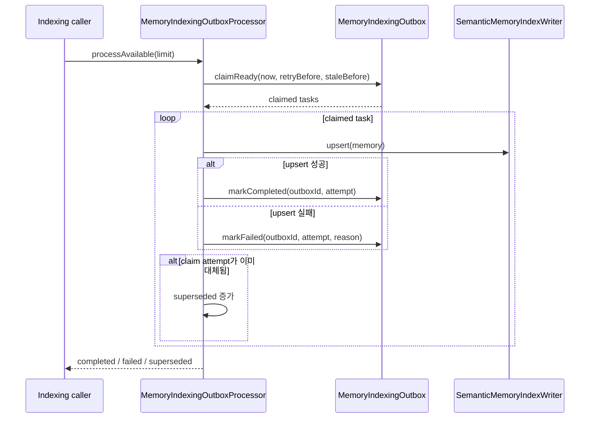

# Memory write use cases

이 패키지는 canonical database commit과 semantic index projection을 분리한다.
`MemoryProposalsPersister`가 원본 기록을 확정하고, `MemoryIndexingOutboxProcessor`가 commit 이후
내구성 있는 outbox를 semantic index에 반영한다.

## Canonical memory commit

## Indexing outbox 처리

## 규칙

- idempotency key는 작성자, 의미 필드와 정렬된 evidence ID 전체를 SHA-256으로 계산한다.
- canonical commit과 outbox enqueue는 같은 transaction이어야 한다.
- indexing 실패는 canonical memory를 롤백하지 않는다.
- 처리 lease가 만료된 `PROCESSING` 작업과 retry delay가 지난 실패 작업은 다시 claim할 수 있다.
- `reindexAll`은 outbox row가 없는 canonical memory까지 다시 enqueue한다.
