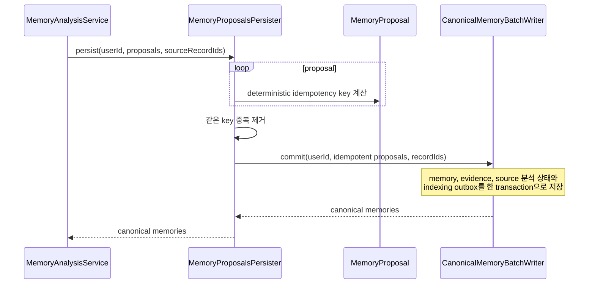
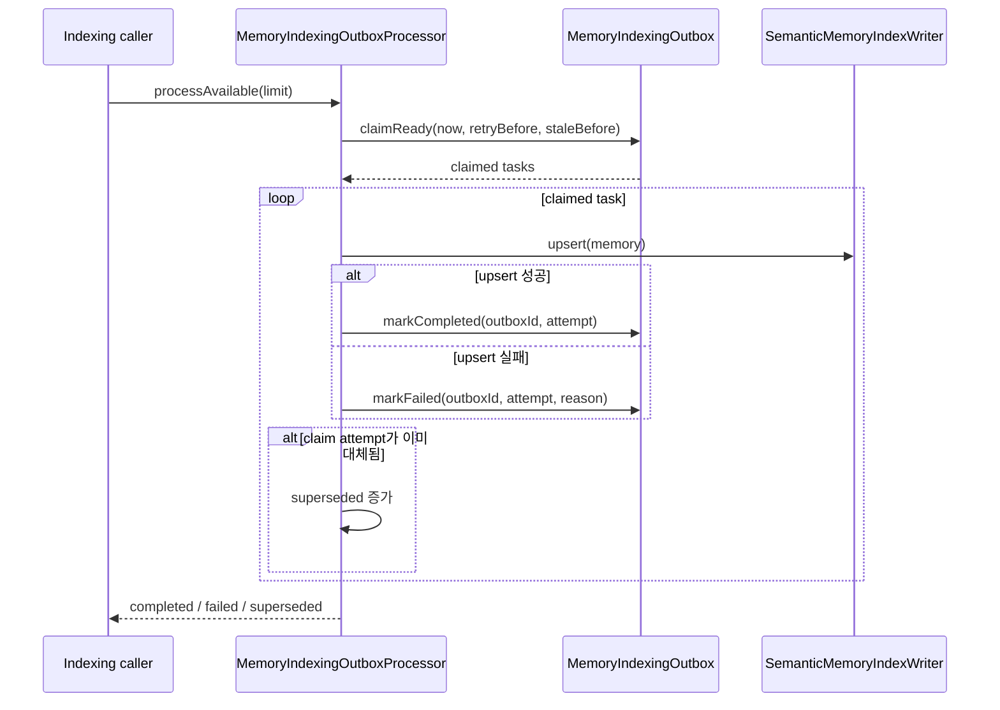

# Memory write use cases

이 패키지는 canonical database commit과 semantic index projection을 분리한다.
`MemoryProposalsPersister`가 원본 기록을 확정하고, `MemoryIndexingOutboxProcessor`가 commit 이후
내구성 있는 outbox를 semantic index에 반영한다.

## Canonical memory commit

```mermaid
sequenceDiagram
    participant Analysis as MemoryAnalysisService
    participant Persister as MemoryProposalsPersister
    participant Proposal as MemoryProposal
    participant Writer as CanonicalMemoryBatchWriter

    Analysis->>Persister: persist(userId, proposals, sourceRecordIds)
    loop proposal
        Persister->>Proposal: deterministic idempotency key 계산
    end
    Persister->>Persister: 같은 key 중복 제거
    Persister->>Writer: commit(userId, idempotent proposals, recordIds)
    Note over Writer: memory, evidence, source 분석 상태와<br/>indexing outbox를 한 transaction으로 저장
    Writer-->>Persister: canonical memories
    Persister-->>Analysis: canonical memories
```

## Indexing outbox 처리

```mermaid
sequenceDiagram
    participant Worker as Indexing caller
    participant Processor as MemoryIndexingOutboxProcessor
    participant Outbox as MemoryIndexingOutbox
    participant Index as SemanticMemoryIndexWriter

    Worker->>Processor: processAvailable(limit)
    Processor->>Outbox: claimReady(now, retryBefore, staleBefore)
    Outbox-->>Processor: claimed tasks
    loop claimed task
        Processor->>Index: upsert(memory)
        alt upsert 성공
            Processor->>Outbox: markCompleted(outboxId, attempt)
        else upsert 실패
            Processor->>Outbox: markFailed(outboxId, attempt, reason)
        end
        alt claim attempt가 이미 대체됨
            Processor->>Processor: superseded 증가
        end
    end
    Processor-->>Worker: completed / failed / superseded
```

## 규칙

- idempotency key는 작성자, 앞뒤 공백을 제거한 content와 중복 제거·정렬한 evidence ID 전체를
  SHA-256으로 계산한다. 같은 내용이어도 작성자나 근거 집합이 다르면 별도 기록으로 보존한다.
- canonical commit과 outbox enqueue는 같은 transaction이어야 한다.
- indexing 실패는 canonical memory를 롤백하지 않는다.
- 처리 lease가 만료된 `PROCESSING` 작업과 retry delay가 지난 실패 작업은 다시 claim할 수 있다.
- `reindexAll`은 outbox row가 없는 canonical memory까지 다시 enqueue한다.

## 저장 모델과 인덱스

Memory는 ID, content, 근거, ACL, 등록자와 저장 시각을 보존한다. `memoryType`, `certainty`,
`subject`, Memory DB의 `updatedAt`과 `childrenIds`는 저장하지 않는다. 조직 관계는 Topic에서
관리하며 Memory 저장 transaction과 분리한다. outbox의 상태·시각·재시도 계약은 유지한다.

임베딩 입력은 `passage: ` 접두어와 content다. 벡터 payload에는 `kind`, `memoryId`만 저장하며
ACL과 배치 관계를 복제하지 않는다. 열람 가능 ID는 canonical DB에서 결정한다.

이 변경은 미배포 상태를 전제로 기존 필드·키에 대한 호환 migration을 제공하지 않는다.
기존 개발 DB는 자동 변환되지 않으며, 이전 스키마에는 더 이상 쓰지 않는 필수 열이 남아 새 저장이
실패할 수 있다. 사용 전 필요한 데이터를 보존하고 새 DB로 구성해야 한다. 기존 벡터 데이터도
이전 임베딩 입력을 사용하므로 새 canonical DB 기준의 재색인이 필요하다. 코드 변경 자체는 DB나
벡터 데이터를 초기화하지 않는다.
