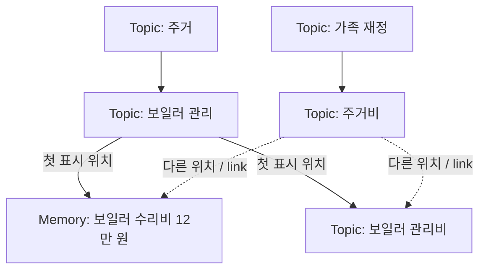

# 가족 Memory Graph 설계

## 1. 목표와 결정

가족의 기억은 근거가 있는 원자적 사실인 `Memory`로 보존한다. `Topic`은 하나 이상의
`Memory` 또는 다른 `Topic`을 포함하는 이름 있는 집합이다. 하나의 `Memory`나 `Topic`은
여러 `Topic`에 속할 수 있다. 따라서 저장 구조는 트리가 아니라 **방향성 비순환 그래프(DAG)**다.

평소 탐색 화면에서는 사용자에게 보이는 DAG를 순회해 각 노드를 처음 만난 위치에서 펼친다.
다른 부모 아래에는 같은 노드의 **link**를 보여 준다. link는 복사본이 아니라 원래 노드의
ID를 가리키는 화면 표현이다. 저장된 base parent나 사용자별 base 설정은 두지 않는다.

이 문서의 결정은 다음과 같다.

1. `Memory`는 원자적 사실이며 자식을 갖지 않는다. 내용, 근거, 확실성, 시간 정보와 기존
   `UserId` 기반 ACL은 Topic 배치와 독립적으로 보존한다.
2. `Topic`은 고정된 범위 설명인 summary와 수정 이력을 가진 본문을 갖고, 직접 자식으로
   하나 이상의 `Memory` 또는 `Topic`을 가진다. 자식은 여러 부모를 가질 수 있다. Topic의
   전체 사실 집합은 직접 포함한 Memory와 모든 하위 Topic의 Memory를 합친 결과다. 같은
   Memory가 여러 경로로 도달되더라도 한 번만 센다.
3. 부모·자식 관계는 **포함**만 뜻한다. 이 설계의 link는 다른 부모 아래에 표시하는
   동일 노드의 참조다. 포함이 아닌 자유로운 `RELATED` 관계는 첫 버전의 모델에 넣지 않는다.
4. Memory, Topic, 포함 관계의 기록에 각각 열람 권한을 부여한다. 사용자가 양 끝 노드와
   관계 기록을 모두 볼 수 있을 때만 관계를 보여 준다.
5. Topic의 생성·이동·병합은 조직의 변경이다. Memory의 내용, ID, 근거, ACL을 변경하지 않는다.
6. 같은 사실·범위·포함 관계가 서로 다른 ACL과 근거로 기록될 수 있다. 각 기록은 유지하고,
   여러 기록을 볼 수 있는 사용자에게만 화면에서 중복을 묶는다.

이 설계는 기존의 [구조 탐색](research/memory-consolidation-and-topic-hierarchy.md)을
구체화한다. 구현이나 운영 데이터 변경은 이 문서의 범위가 아니다.

## 2. 그래프의 의미

화살표는 `Topic → 자식`의 포함 관계다. 그림의 점선도 저장소에서는 실선과 같은 포함
관계이며, 표시할 때만 link가 된다. 그림은 `보일러 관리`를 먼저 방문한 화면의 예시다.
첫 표시 위치는 저장된 속성이 아니라 사용자별 탐색 결과다. `보일러 관리비`가 아직 유용한
탐색 범위가 아니라면
Topic으로 만들지 않고 수리비 Memory만 두 Topic에 직접 연결하면 된다.

### 2.1 Topic의 정체성

Topic은 `id`, 대표 이름, 처음 정한 짧은 범위 설명(summary), 본문, ACL을 갖는다. 이름이나
경로가 ID는 아니다. summary는 현재 자식 목록을 요약한 문장이 아니라 Topic이 다루는 범위의
정의다. 자식이 추가되어도 다시 생성하거나 수정하지 않는다. 예를 들어
`현재 집의 보일러`는 이전 집의 보일러와 다른 Topic이다. Topic의 구성원이 달라져도 같은
탐색 범위를 나타낸다면 ID를 유지한다. 범위 자체가 달라져야 한다면 기존 summary를 고치는
대신 새 Topic을 만든다.

Topic의 **현재 구성원 목록만으로** Topic의 정체성이나 부모 관계를 결정하지 않는다.
지금 `보일러 관리`에 수리비 기억만 있어도, 향후 모델명·사용법이 들어올 수 있으므로
`보일러 관리` 전체가 `주거비`의 하위 Topic은 아니다. 부모 관계는 자식 Topic의 **범위 전체**가
부모의 탐색 범위 안에 들어갈 때 만든다. 이 기준에 미치지 못하면 관련된 개별 Memory를
각 Topic에 직접 소속시킨다.

### 2.2 저장 관계와 불변식

| 관계 | 의미 | 허용 여부 |
|---|---|---|
| `Topic → Memory` | 해당 사실을 이 주제에서 찾는다 | 복수 부모·관계 근거 허용 |
| `Topic → Topic` | 자식 주제 전체를 상위 주제에서 찾는다 | 복수 부모·관계 근거 허용, 순환 금지 |
| `Memory → Memory/Topic` | Memory를 상위 컨테이너로 사용 | 허용하지 않음 |

- 각 일반 Topic은 저장 그래프에서 직접 자식이 하나 이상 있어야 한다. Topic 생성과 첫 자식
  연결은 한 변경으로 적용한다. 마지막 자식을 제거하려면 Topic도 함께 제거·병합하거나 변경을
  거절한다. 시스템 `미분류` Topic은 비어 있어도 저장할 수 있으나 화면에서는 숨긴다.
- 같은 부모·자식 사이에 출처와 ACL이 다른 포함 관계 기록을 여러 개 둘 수 있다. 같은 요청의
  재시도로 동일한 기록을 중복 저장하지 않는다. 사용자 화면에는 볼 수 있는 관계 기록이 하나
  이상일 때 논리적 연결을 한 번만 표시한다.
- 모든 관계 기록을 합친 저장 그래프에서 자기 참조와 간접 순환을 허용하지 않는다.
- 저장된 base parent는 없다. 어떤 사용자의 화면에서 부모가 안 보이는 Topic은 다른 보이는
  부모 아래에 놓거나 최상위 Topic으로 표시한다.
- 한 Memory가 여러 Topic에 연결되어도 Memory 자체는 하나다. 링크마다 새 Memory, 근거,
  검색 인덱스를 만들지 않는다.
- 모든 Memory는 생성 시점부터 적어도 하나의 Topic에 속한다. 모든 열람 가능 사용자에게
  보이는 Topic 경로가 하나 이상 있어야 한다. 일반 Topic 배치에 실패하거나 접근 범위가
  맞지 않는 경우에도 시스템 `미분류` Topic과 해당 Memory의 ACL을 따르는 관계 기록을 둔다.

### 2.3 Topic 생성과 변경

새 기록을 배치할 때는 같은 범위의 기존 Topic을 먼저 찾는다. 이름이 비슷하다는 이유만으로
합치거나 새 부모를 만들지 않는다. 기존 Topic에 Memory를 직접 연결하는 것으로 충분하면
그렇게 한다. 새 Topic은 독립적으로 다시 찾을 범위가 있고, 그 범위를 짧게 설명할 수 있을 때
만든다. 한 번 발생한 사건이나 한 문장을 담기 위해 자동으로 중간 Topic을 만들지 않는다.

새 Topic 전체가 기존 Topic의 고정된 범위 설명에 들어가면 그 아래에 연결한다. 어느 한쪽도
다른 쪽을 포함하지 않지만 두 범위를 아우르는 유용한 주제가 있다면 공통 부모를 만든다.
단지 이름이 비슷하다는 이유로 중간 계층을 늘리지 않는다. 권한 필터 뒤에는 한 사용자에게
중간 Topic의 자식 하나만 보일 수도 있으므로, 다른 직접 자식이 없는 한 갈래 경로는 화면에서
압축해 보여 줄 수 있다. 주기적으로 너무 넓거나 깊거나 파편화된 Topic을 점검하고, 필요한
구조 변경을 제안한다. 자식을 추가하기 위해 기존 Topic의 summary를 고치지 않는다.

재정리는 Topic 생성, 특정 관계 기록 추가·해제, Topic 병합·분할로 표현한다.
병합은 이름이 비슷한 경우가 아니라 **범위가 동일한 경우**에만 한다. 변경 제안은 적용 직전의
그래프를 기준으로 검증하고, 전체 변경을 한 트랜잭션으로 적용하거나 모두 거절한다.
변경 전후의 관계와 이유를 기록해 잘못된 재정리를 되돌릴 수 있게 한다. 이전 Topic ID를
참조하는 링크가 있다면 병합 후에도 대표 Topic으로 해석할 수 있어야 한다.

### 2.4 권한이 다른 동일 사실과 주제

문장이 같아도 출처와 ACL이 다른 `m1`, `m2`는 별도 Memory로 보존한다. 동일 사실 여부는
문자열이 아니라 대상·내용·적용 시점과 조건을 비교해 판단한다. `m2`가 들어왔을 때
요청자에게 보이지 않는 `m1`에 덮어쓰거나 `m1`의 ACL을 넓히지 않는다. 숨겨진 중복의
존재 때문에 등록을 거절하거나 응답을 달리하지도 않는다.

Topic에도 같은 원칙을 적용한다. `t1`이 한 사용자에게만 보이면 다른 사용자를 위해
그 ACL을 자동으로 넓히지 않는다. 같은 탐색 범위의 `t2`가 별도로 생길 수 있다. 단,
상위 Topic `T`에 Memory를 직접 두어도 탐색에 충분하다면 `t2`를 만들 필요는 없다.
같은 범위의 Topic이라도 ACL이 다르면 저장된 노드를 자동 병합하지 않는다.

저장된 기록 사이의 동일성은 포함 관계와 별개인 내부 중복 판정으로 관리한다. 그 판정은
원래 Memory·Topic의 ID, 근거, ACL, 소속을 대체하지 않으며 사용자에게 독립적인 탐색
링크로 노출하지 않는다. 판정이 틀렸거나 기록이 정정되어 의미가 달라지면 묶음을 해제할
수 있어야 한다.

### 2.5 Topic 본문과 주제별 구성

Topic의 본문은 해당 주제를 읽는 순서와 맥락을 설명하는 편집 가능한 문서다. 문단·목록과
Memory 또는 하위 Topic 참조를 포함할 수 있으며 변경 이력을 남긴다. 고정된 summary와 달리
본문은 새 기록이나 재정리에 맞춰 개정할 수 있다. 하위 Topic이 있어도 본문을 둘 수 있지만,
본문을 하위 내용의 자동 생성 요약으로 취급하지 않는다.

같은 Memory를 여러 Topic에 연결해도 사실의 내용과 근거는 Memory에 한 번만 저장한다.
Topic마다 본문에서 그 Memory를 다른 순서·절·설명으로 다룰 수 있다. 예를 들어 같은
`보일러 수리비 12만 원` Memory를 `보일러 관리`에서는 수리 경과의 일부로, `주거비`에서는
비정기 지출의 일부로 설명한다. 두 설명은 각 Topic의 본문에 속하며 Memory의 새 복사본이
아니다. 본문에 새 사실을 쓰려면 먼저 근거가 있는 Memory로 보존하고 그 ID를 참조한다.

공개 Topic이 비공개 Memory도 포함할 수 있으므로 본문 전체를 하나의 공개 문자열로 저장하면
안 된다. 본문은 순서가 있는 블록으로 구성하고, 각 블록에 ACL·참조 Memory·참조 포함 경로와
개정 이력을 둔다. 블록의 허용 범위는 Topic과 블록이 언급한 Memory·관계·근거의 허용 범위를
넘지 않는다. 아무 사실도 인용하지 않는 공통 안내 문단은 Topic의 ACL 범위에서 볼 수 있다.
사용자 화면에서는 허용된 블록 중 본문 Topic에서 참조 노드까지 보이는 포함 경로가 있는
블록만 이어서 구성한다. 참조한 사실이나 연결이 더는 보이지 않으면 해당 블록도 표시하지
않고 개정 대상으로 표시한다.

## 3. 권한

`PUBLIC`은 등록된 모든 사용자가 볼 수 있고, `RESTRICTED`는 고정된 application `UserId`
집합만 볼 수 있다는 기존 계약을 사용한다. 원본과 Memory의 ACL은 그래프 재배치 때문에
넓어지지 않는다. Topic의 이름·summary도 정보이므로 Topic 자체에 ACL을 둔다. 본문
블록에는 별도 ACL을 둔다. 부모와 자식 Topic의 ACL은 서로 독립적이다. 부모를 볼 수 없어도
자식을 볼 수 있으며 그 반대도 가능하다.

포함 관계 기록에도 ACL과 근거를 둔다. 사용자가 부모 Topic, 자식 Memory 또는 Topic,
관계 기록을 모두 볼 수 있을 때만 그 연결을 볼 수 있다. 관계의 허용 범위는 양 끝 노드와
관계를 뒷받침하는 근거의 허용 범위를 넘어서지 않는다. 같은 부모·자식 관계를 다른 권한의
근거가 독립적으로 뒷받침할 수 있으며, 사용자는 허용된 근거만 본다. 공개적인 Topic도 제한된
Memory를 포함할 수 있지만, 권한이 없는 사용자에게는 그 Memory와 연결이 모두 보이지 않는다.
저장 그래프에서 상위 Topic이 포함하는 사실 집합과 사용자에게 보이는 집합은 다를 수 있다.
사용자별 조회·집계는 허용된 관계만 따라가며 숨겨진 관계를 통해 자손을 끌어오지 않는다.

예를 들어 `집을 팔아 아버지 치료비를 마련하기로 했다`는 결정은 하나의 Memory다. 이 Memory를
`주택 매각`과 `아버지 치료비` 양쪽 Topic에 연결하고, 결정의 열람 범위는 Memory의 ACL로
정한다. 두 Topic이 공개되어도 권한이 없는 사용자는 그 결정이나 그 결정으로 생긴 두 소속을
볼 수 없다. 이 결정만을 근거로 두 Topic 사이에 직접 포함 관계를 만들지 않는다. 두 Topic
사이에 별도의 포함 관계가 타당하더라도 비공개 근거에서만 확인됐다면 그 관계 기록 역시
비공개다.

Topic의 이름이나 범위 설명을 비공개 Memory로부터 생성했다면 그 표현을 PUBLIC으로
저장하지 않는다. 접근 범위가 다른 정보를 합쳐 새 Topic을 만들 때는 사용한 정보의 권한
교집합을 적용하며, 교집합이 비면 생성하지 않는다. 이는 Topic의 이름·범위 설명에 대한
규칙이다. 공개 Topic과 제한된 Memory를 연결하는 것은 허용하며, 각 노드의 ACL을 보존하고
사용자별 투영을 검증한다.

열람과 구조 편집은 다른 권한이다. 현재 설계는 열람 권한을 정의하며, 누가 Topic과 관계
기록을 추가·해제할 수 있는지는 후속 설계로 남긴다. 다만 어떤 편집 권한을 주더라도 사용자가
보지 못하는 관계를 일반적인 이동 작업이 암묵적으로 삭제해서는 안 된다. 변경은 명시한
노드 또는 관계 기록 ID를 대상으로 한다.

권한 검사는 자식 목록을 응답한 뒤 가리는 작업이 아니다. Topic 후보 검색, 배치 모델 입력,
탐색 결과, 본문 블록, 링크, 개수, 변경 이력 및 캐시에서 같은 가시성 경계를 적용한다.
하위 Topic의 내용을 모아 상위 Topic의 summary를 다시 쓰지 않는다. 특정 Topic에 보이지
않는 자식이 있는지와 그 개수도 노출하지 않는다.
중복 판정 결과와 동일한 기록의 존재 여부도 마찬가지다. 사용자가 볼 수 없는 `m1` 또는
`t1`이 추가되어도 그 사용자의 탐색·검색·등록 응답은 달라지지 않아야 한다.

변경 이력 기록 자체에도 ACL을 두고, 이전·새 관계, 이유, 근거에도 권한을 적용한다. 예를
들어 옛 부모만 볼 수 있는 사용자에게는 그 연결이 제거됐다는 사실을 보여 줄 수 있지만
새 비공개 부모는 노출하지 않는다.
하나의 이동 작업은 내부에서 연계하되, 열람 시에는 허용된 부분만 표시한다.

## 4. 사용자별 트리 투영

저장된 DAG에서 인증된 사용자에게 보여 줄 결과를 다음 순서로 만든다.

1. 사용자에게 보이는 Memory와 Topic을 선택한다. 포함 관계는 양 끝 노드와 관계 기록이
   모두 보일 때만 사용하고, 같은 부모·자식 사이의 보이는 기록은 논리적 연결 하나로 접는다.
2. 일반 Topic 경로가 없는 Memory는 시스템 `미분류` 아래에 표시한다. 일반 Topic 경로가
   있으면 그 사용자에게는 같은 Memory의 `미분류` 위치를 숨긴다. 이후 보이는 Memory로
   이어지지 않는 빈 Topic은 화면에서 제외한다. 저장된 Topic과 관계를 삭제하지는 않는다.
3. 보이는 최상위 Topic부터 안정적인 ID 순으로 순회한다. 각 노드를 처음 만난 부모 아래에서
   펼치고, 다른 부모 아래에는 `targetNodeId`를 가진 link만 표시한다. link를 열면 같은
   노드의 상세 화면으로 이동하며 그 위치에서 자손을 다시 펼치지 않는다.
4. Topic의 본문은 허용된 블록만 순서대로 구성한다. 블록이 참조하는 Memory·하위 Topic과
   그 포함 관계가 이 사용자에게 보이지 않으면 그 블록도 제외한다.
5. 이 사용자에게 보이는 기록 사이에서만 동일 사실을 화면에 한 건으로 묶고, 접근 가능한
   원문 근거는 각각 표시한다. 같은 범위의 Topic도 화면에서 하나로 묶을 수 있으며, 그때는
   보이는 자식과 위치를 합쳐 표시한다. 범위가 다르면 Topic은 따로 두고 사실만 묶는다.
   화면의 묶음은 저장된 ID·ACL·포함 관계를 변경하지 않는다.

따라서 사용자가 어떤 부모를 볼 수 없어도 볼 권한이 있는 Memory나 Topic이 사라지지 않는다.
처음 표시되는 위치는 사용자에게 보이는 그래프만으로 결정하며 저장하지 않는다. 한 노드의
본문은 투영에서 한 번만 렌더링하고, 보조 위치에서는 참조만 렌더링한다. 같은 Memory를
여러 경로에서 만난 경우에는 ID로, 서로 다른 Memory가 같은
사실로 판정된 경우에는 보이는 중복 묶음으로 사실 개수를 한 번만 센다. 근거 개수는 별도로
센다. 묶음에 속한 원래 ID로 상세 화면을 열어도 사용자가 볼 수 있는 같은 묶음으로 이동한다.
권한에 따라 표시 경로는 달라질 수 있으므로 전체 경로를 노드의 영구 식별자로
사용하지 않는다.

## 5. 조회와 쓰기의 경계

- **직접 검색·답변:** Memory와 그 근거를 기존처럼 직접 검색한다. Topic 그래프가 없거나
  재정리 중이어도 원자적 사실을 찾을 수 있다.
- **탐색:** Topic에서 직접 자식과 하위 Topic을 따라가고, 다른 표시 위치의 link로
  같은 노드에 이동한다. Topic 상세 화면에는 허용된 본문 블록과 사실만 표시·집계한다.
- **쓰기:** source를 보존하고, ACL이 정해진 Memory와 시스템 `미분류` 포함 관계 기록을
  한 트랜잭션으로 확정한다. 비공개 중복이 있어도 새 기록의 출처·ACL을 보존한다. 일반
  Topic 배치는 이후 별도 작업이다. 배치 실패가 원본을 잃게 하거나 Memory를 Topic 없는
  상태로 만들지 않는다. 배치 완료 후에도 일부 사용자에게 일반 Topic 경로가 없으면 그
  사용자의 `미분류` 경로를 유지한다.
- **동시성:** 배치 제안이 읽은 관계 상태를 적용 시 다시 확인하고, 오래된 제안은 다시
  계산한다. 비공개 변경 때문에 무관한 사용자의 작업에 전역 버전 충돌이 노출되지 않도록
  충돌 범위를 좁히거나 서버 내부에서 재시도한다. 프로세스 내부 mutex만으로 다중 실행자의
  경합을 해결했다고 간주하지 않는다.

첫 저장 모델은 기존 SQLite 안의 `Topic`, 본문 블록과 개정 이력, `Topic→Topic`,
`Topic→Memory` 관계 기록으로 충분하다. 각 관계 기록은 ACL·근거를 보존하고 같은 두 노드
사이에도 여러 개 존재할 수 있다.
두 종류의 관계 테이블을 사용해 각 자식에 대한 외래 키를 명확히 할 수 있다. 이는 **하나의
논리적 Memory Graph**를 여러 테이블에 저장하는 방식이다. 별도 그래프 DB나 서비스는
필요하지 않다. 현재 `Memory.childrenIds`는 새 모델의 부모 관계를 계속 저장하는 필드가
되지 않는다.

## 6. 검증 사례

설계와 후속 구현은 최소한 다음 사례를 통과해야 한다.

1. 수리비 Memory 하나가 `보일러 관리`와 `주거비`에 연결된다. 사용자별 첫 표시 위치에는 본문,
   다른 부모 아래에는 같은 ID의 link가 보이며 검색·집계에는 한 건이다.
2. `보일러 관리비` Topic이 두 Topic을 부모로 갖는다. 그 아래의 모든 사실을 양쪽에서
   찾을 수 있고, 화면의 자손은 첫 표시 위치에서만 펼쳐진다.
3. 현재 `보일러 관리`의 모든 사실이 비용이더라도 이를 자동으로 `주거비` 하위로 만들지
   않는다. 비비용 사실이 들어와도 기존 Topic의 고정 summary와 관계가 의미상 유지된다.
4. 저장 그래프의 순환과 자기 참조는 거절한다. 같은 두 노드에 서로 다른 근거·ACL의 관계
   기록은 허용하지만 같은 요청을 재시도해 동일한 기록을 중복 저장하지 않는다.
5. 제한된 Memory·Topic·관계 기록이 다른 사용자에게 이름, link, 개수, 검색 결과, 모델
   입력으로 드러나지 않는다. 양 끝 Topic이 공개여도 관계 기록이 비공개면 연결은 보이지
   않는다. 비공개 부모 아래의 공개 자식은 해당 사용자에게 다른 경로 또는 최상위로 보인다.
6. 배치 또는 재정리 실패 후에도 Memory와 원문 근거는 보존된다. 같은 요청을 재시도해도
   중복 Topic·관계 기록이 생기지 않는다. 새 Memory는 모든 열람 가능 사용자에게 처음부터
   적어도 하나의 보이는 Topic 경로가 있으며, 일반 배치 실패 시 `미분류`에 남는다.
7. `u1, u3`가 보는 `m1, t1`, `u2, u3`가 보는 동일 사실의 `m2, t2`, 셋 모두 보는 상위 Topic
   `T`가 있다. `u2`의 등록은 숨겨진 `m1, t1`의 존재를 알리지 않으며 `u1`의 결과도 바꾸지 않는다.
   `t2`가 탐색에 불필요하면 `m2`를 `T`에 직접 둔다.
8. `u3`가 두 기록을 모두 볼 수 있으면 사실은 한 건, 근거는 두 건으로 표시한다. `t1`과 `t2`의
   범위도 같다면 화면에서 한 Topic으로 묶고, 다르면 두 Topic을 유지한다. 어느 경우에도
   저장된 노드의 ID, ACL, 출처, 소속은 바뀌지 않는다.
9. 같은 공개 Topic 두 개 사이의 관계를 `u1`과 `u2`가 각각 다른 비공개 근거로 기록한다.
   각자는 자신의 관계 기록만 볼 수 있고, 둘 다 볼 수 있는 `u3`에게는 연결 한 개와 허용된
   근거 두 개가 보인다. 한쪽 기록의 해제가 다른 기록을 삭제하지 않는다.
10. 보이지 않는 부모나 관계의 변경은 다른 사용자의 첫 표시 위치·요약·개수·이력·충돌
    응답을 바꾸지 않는다. 이동 이력에서 옛 부모나 새 부모 중 허용되지 않은 부분은 숨긴다.
11. 하나의 Memory가 두 Topic의 본문에서 다른 맥락과 순서로 설명된다. 두 본문 모두 같은
    Memory ID와 원문 근거를 가리키며, 한쪽 본문 개정은 Memory나 다른 Topic의 본문을
    변경하지 않는다. 비공개 Memory를 인용하는 본문 블록은 공개 Topic에서도 무권한자에게
    보이지 않는다.

## 7. 이번 설계에서 제외하는 것

포함 관계가 아닌 자유로운 `RELATED` 링크, 자식 목록을 반영해 계속 바뀌는 Topic 요약,
Topic 품질 점수와 재구조화의 정확한 주기, Memory의 정정·시간 변화 모델은 이 문서의
그래프 계약을 구현하는 데 필수적이지 않다. 내부 중복 판정은 자유로운 `RELATED` 탐색
링크가 아니다. 열람 권한과 별개인 구조 편집 권한의 상세 정책도 후속 설계로 둔다. 기존
Memory의 근거·권한을 Topic 본문에 복제하거나, 본문의 설명을 원문 근거를 대신하는 사실로
검색 결과에 제시하지 않는다.

## 참고

- [기존 구조 조사](research/memory-consolidation-and-topic-hierarchy.md)
- [운영·권한 참고](research/memory-consolidation-operations-notes.md)
- [현재 Memory 배치 use case](../application/src/main/kotlin/com/homeassistant/application/usecase/memory/placement/README.md)
- [현재 visible tree use case](../application/src/main/kotlin/com/homeassistant/application/usecase/memory/tree/README.md)
- [SKOS의 계층·관련·collection 구분](https://www.w3.org/TR/skos-reference/)
- [Getty의 복수 부모와 preferred parent](https://www.getty.edu/publications/vocabularies-editorial-guidelines/aat-guidelines/3_editorial_rules/3.1/)
- [W3C PROV의 동일 대상에 대한 별도 기록과 출처](https://www.w3.org/TR/prov-dm/)
- [NIST의 다중 보안 등급 DB와 복수 기록 논의](https://csrc.nist.gov/files/pubs/conference/1989/10/10/proceedings-12th-national-computer-security-confer/final/docs/1989-12th-ncsc-proceedings.pdf)
