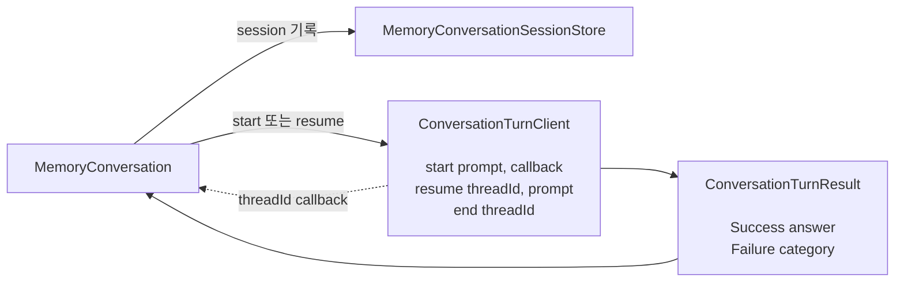
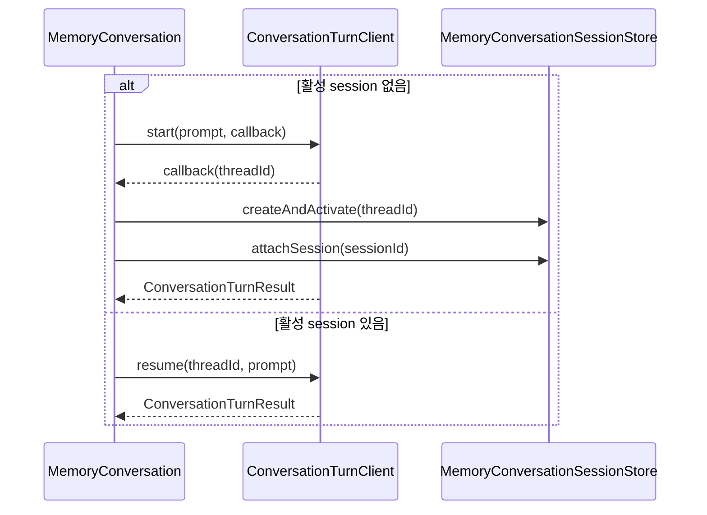
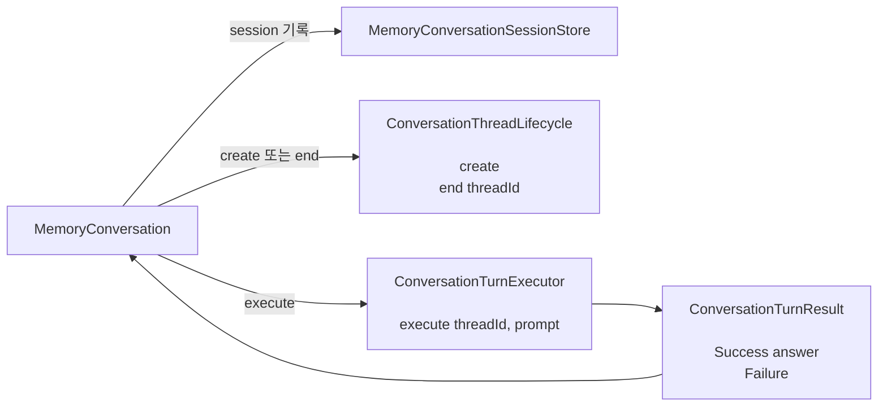
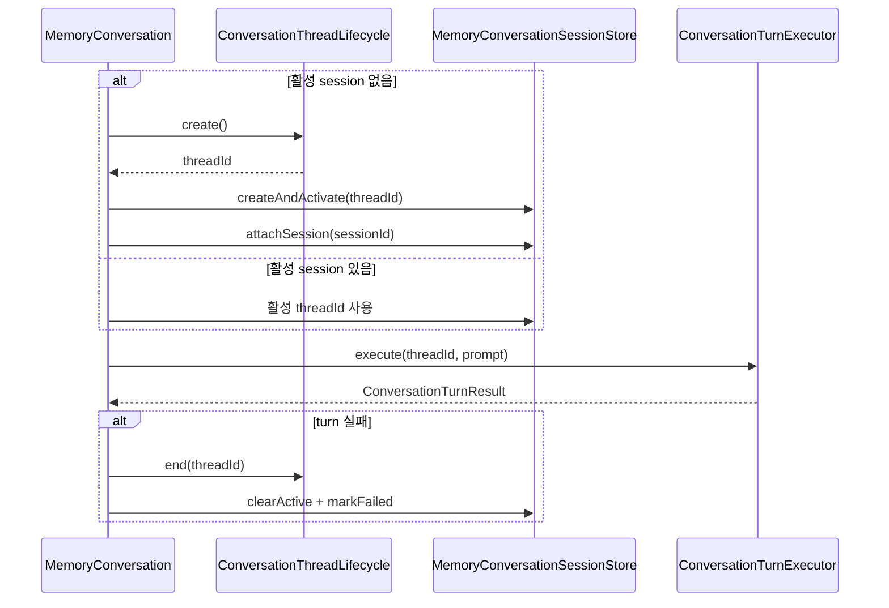

# Conversation thread lifecycle과 turn 실행 분리

- 상태: DONE
- 우선순위: P0
- 완료일: 2026-09-06
- 범위: memory conversation의 application port와 use case orchestration

## 문제

현재 `ConversationTurnClient`는 서로 다른 두 책임을 하나의 인터페이스에 담고 있다.

1. conversation thread 생성과 종료
2. conversation thread에서 한 번의 turn 실행

특히 `start(prompt, onThreadStarted)`는 thread 생성 결과는 callback으로 전달하고, turn 실행 결과는
반환값으로 전달한다. 하나의 호출에 두 작업과 두 결과 전달 방식이 섞여 있다.

## 설계 결론

`MemoryConversation` input port의 책임과 공개 API는 바뀌지 않는다. 이 port를 구현하는 memory
conversation use case가 thread를 언제 생성하고 종료할지 결정하는 lifecycle 정책을 소유한다.

- memory conversation use case: session 상태에 따라 thread 생성·재사용·종료 시점을 결정한다.
- `ConversationThreadLifecycle`: 결정된 thread 생성과 종료를 수행한다.
- `ConversationTurnExecutor`: 주어진 thread에서 turn을 실행한다.
- `MemoryConversationSessionStore`: thread ID와 활성 session 관계를 저장한다.

AS-IS에서도 use case가 `start`, `resume`, `end`를 호출하므로 lifecycle에 전혀 관여하지 않았던 것은
아니다. 다만 thread 생성이 `start(prompt, callback)` 내부에 포함되어 생성 시점과 저장 순서가
암묵적이었다. TO-BE에서는 `create`, session 기록, `execute`, 실패 시 `end` 순서가 use case
orchestration에 명시적으로 나타난다.

## AS-IS





AS-IS에서는 memory conversation use case가 새 thread와 기존 thread를 `start`와 `resume`으로
구분하지만, 실제 thread 생성은 `start` 내부에서 일어나고 callback 시점에 session을 기록한다.
`ConversationTurnClient`는 이름과 달리 thread lifecycle까지 함께 담당한다.

## TO-BE





TO-BE에서는 memory conversation use case가 lifecycle을 명시적으로 관리한다. 활성 session이 없으면
`create` 후 session을 기록하고, 활성 session이 있으면 저장된 thread ID를 선택한다. 새 thread인지
기존 thread인지와 관계없이 turn 실행은 항상 `execute`로 표현한다. 외부 시스템에 thread를 다시
로드해야 하는지는 `ConversationTurnExecutor` 계약 밖의 세부사항이다.

## 목표 인터페이스

```kotlin
interface ConversationThreadLifecycle {
    fun create(): String
    fun end(threadId: String)
}

interface ConversationTurnExecutor {
    fun execute(
        threadId: String,
        prompt: String,
    ): ConversationTurnResult
}

sealed interface ConversationTurnResult {
    data class Success(val answer: String) : ConversationTurnResult
    data object Failure : ConversationTurnResult
}
```

## 변화 요약

| 구분 | AS-IS | TO-BE |
|---|---|---|
| Thread 생성 | `start`에 포함 | `ConversationThreadLifecycle.create` |
| Thread 종료 | `ConversationTurnClient.end` | `ConversationThreadLifecycle.end` |
| Turn 실행 | `start` 또는 `resume` | `ConversationTurnExecutor.execute` |
| Thread ID 전달 | callback | `create` 반환값 |
| 실패 결과 | `Failure(category: String)` | `Failure` |
| Session persistence | 기존 방식 | 변경 없음 |

## 작업 계획

### 1. Application output port 분리

- `ConversationTurnClient`를 `ConversationThreadLifecycle`과 `ConversationTurnExecutor`로 분리한다.
- `start`, `resume`, thread ID callback을 제거한다.
- `ConversationTurnResult.Failure(category)`를 상세 값이 없는 `Failure`로 변경한다.

검증 기준:

- application port에 thread 생성과 turn 실행을 함께 수행하는 메서드가 없다.
- application에서 `resume`이라는 메서드를 호출하지 않는다.

### 2. Thread 생성과 turn 실행 경계 분리

- conversation integration이 thread 생성과 turn 실행을 별도 호출로 제공하게 한다.
- turn 실행 시 thread를 외부 runtime에 다시 로드해야 하는지는 integration 내부에서 판단한다.
- 구체적인 실패 원인은 integration 경계에서 기록하고 application에는 성공 또는 실패만 전달한다.

검증 기준:

- thread 생성만 요청했을 때 turn이 실행되지 않는다.
- 이미 사용 가능한 thread의 turn 실행에는 불필요한 재로드가 발생하지 않는다.
- 재로드가 필요한 thread도 application에서는 동일한 `execute` 호출로 처리된다.

### 3. Memory conversation lifecycle orchestration 명시

- 활성 session이 없으면 `create → createAndActivate → attachSession → execute` 순서로 처리한다.
- 활성 session이 있으면 저장된 thread ID로 `execute`만 호출한다.
- idle session은 기존 thread를 `end`한 뒤 새 thread를 생성한다.
- thread 생성 이후 session 기록 또는 turn 실행이 실패하면 thread를 `end`하고 활성 session을 정리한다.
- callback 전달을 위해 사용하던 중간 상태를 제거한다.

검증 기준:

- 신규 conversation의 생성, 저장, 실행 순서가 테스트로 고정된다.
- 기존 conversation에서는 새 thread를 만들지 않는다.
- 실패하거나 만료된 thread는 활성 session으로 다시 사용되지 않는다.

### 4. Idle expiry 의존성 축소

- idle conversation 만료 use case는 `ConversationThreadLifecycle`만 사용하게 한다.
- 만료된 session을 비활성화하고 thread를 종료하는 현재 동작은 유지한다.

검증 기준:

- idle expiry 흐름은 turn 실행 port에 의존하지 않는다.
- 10분 idle 기준과 종료 실패의 best-effort 처리는 유지된다.

### 5. Outbound adapter와 조립부 갱신

- 하나의 outbound adapter가 두 application port를 구현하게 한다.
- memory conversation use case에는 lifecycle과 executor 역할을 각각 주입한다.
- 관리 runtime 시작, availability 확인, 종료 방식은 유지한다.

검증 기준:

- application은 분리된 두 계약만 사용한다.
- 물리적인 Codex 연결과 runtime lifecycle은 중복 생성되지 않는다.

### 6. 테스트와 문서 갱신

- application 테스트에 신규 session, 기존 session, idle 만료, 생성 실패, turn 실패 흐름을 반영한다.
- outbound adapter 테스트에서 thread 생성 결과와 turn 결과의 변환을 각각 검증한다.
- conversation integration 테스트에서 thread 생성과 turn 실행이 독립적으로 동작하는지 검증한다.
- 이 문서와 application use case README의 sequence diagram을 실제 호출 순서에 맞춘다.

최종 검증:

```powershell
.\gradlew.bat :application:test
.\gradlew.bat :adapter-outbound:test
.\gradlew.bat :integration-codex:test
.\gradlew.bat :app:test
.\gradlew.bat test
```

## 완료 조건

- memory conversation use case에서 thread lifecycle 순서가 코드만 읽어도 드러난다.
- `start(prompt, callback)`과 application 수준의 `resume`이 제거된다.
- thread lifecycle과 turn 실행이 서로 다른 application port로 표현된다.
- turn 성공·실패, session lease, idempotency 등 기존 사용자 동작은 유지된다.
- persistence schema와 transaction 경계는 변경되지 않는다.

## 변경하지 않는 것

- 10분 idle session lease
- 요청 idempotency와 receipt 상태 전이
- session에 Codex thread ID를 기록하는 방식
- persistence schema와 transaction 경계
- structured answer 검증
- Slack 계약

## 구현 결과

- application output port를 `ConversationThreadLifecycle`과 `ConversationTurnExecutor`로 분리했다.
- memory conversation use case가 `create → session 기록 → execute` 순서를 명시적으로 조정한다.
- application 수준의 `start`, `resume`과 thread ID callback을 제거했다.
- Codex conversation integration은 `execute`할 thread가 로드되지 않았을 때만 내부적으로 다시 로드한다.
- `ConversationTurnResult.Failure`에서 사용하지 않던 문자열 category를 제거했다.
- 구형 process 기반 conversation client와 전용 JSONL parser 및 상태 모델을 제거했다.
- persistence schema와 transaction 경계는 변경하지 않았다.

## 검증 결과

- 신규 thread 생성, session 기록, turn 실행 순서를 application 테스트로 고정했다.
- 생성 실패, session 연결 실패, 신규·기존 thread의 turn 실패와 idle 만료 정리를 검증했다.
- Codex integration에서 thread 생성과 turn 실행의 분리 및 lazy resume을 검증했다.
- `./gradlew test` 전체 테스트가 통과했다.
