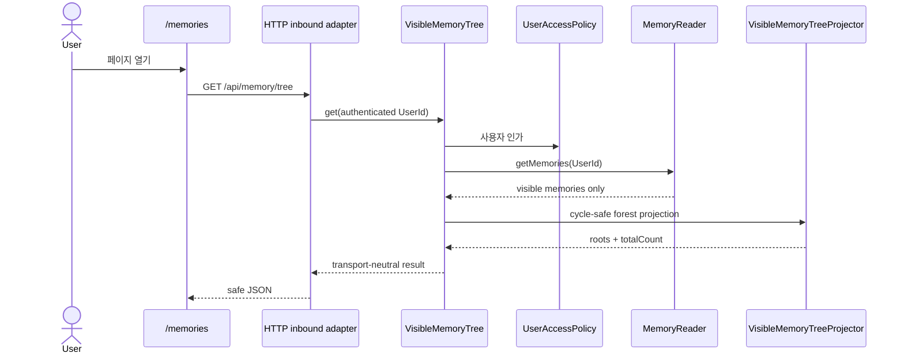

# 사용자별 Memory Tree 조회 페이지

- 상태: DONE
- 요청일: 2026-09-10
- 완료일: 2026-09-12

## 문제와 목표

Canonical memory는 single-parent tree 관계와 사용자별 ACL을 갖지만, 등록 사용자가 자신에게 보이는
tree를 직접 확인할 HTTP API와 웹 화면이 없었다. 기존 placement renderer는 모델 입력 문자열을 만드는
별도 책임이므로 사용자 조회 경로에 재사용하지 않는다.

목표는 기존 memory를 수정하지 않는 작은 read-only 기능으로 다음을 제공하는 것이었다.

- 인증 principal 기준 visible memory 조회
- framework와 독립된 application input port/use case
- domain object와 ACL 내부 정보를 노출하지 않는 HTTP 응답
- cycle과 잘못된 legacy 관계에도 멈추지 않는 tree 화면

## 경계

- `application/port/input/memory/tree`는 조회 요청, 결과와 unavailable failure 계약만 정의한다.
- `application/usecase/memory/tree`는 사용자 인가, visible read와 forest projection을 담당한다.
- `adapter-inbound/http`는 principal 변환, 상태 코드와 JSON/HTML 표현만 담당한다.
- composition root는 기존 `MemoryReader`와 `UserAccessPolicy`로 use case를 조립한다.
- 새 output port, repository, DB table과 migration은 추가하지 않았다.

## 구현 내용

### Application

- `VisibleMemoryTree` input port와 `ViewVisibleMemoryTree` 구현을 추가했다.
- 화면 node는 ID, subject, content, type, certainty, 생성 시각과 children만 제공한다.
- `createdByUserId`, `allowedUserIds`, `evidenceRefs`를 조회 응답에서 제외했다.
- visible 집합 밖의 child reference와 self reference는 무시한다.
- 다중 parent는 낮은 parent ID를 결정적으로 선택한다.
- cycle 또는 root가 없는 component도 방문 집합을 이용해 각 memory를 한 번만 별도 root 아래 노출한다.
- root와 sibling은 memory ID 오름차순으로 고정한다.
- reader failure는 `VisibleMemoryTreeUnavailableException`으로 변환한다.

### HTTP와 HTML

- 공개 정적 페이지 `GET /memories`를 추가했다.
- 인증된 read API `GET /api/memory/tree`를 추가했다.
- caller `UserId`는 query/body가 아니라 `HttpUserPrincipal`에서만 얻는다.
- 미인증은 `401`, application 인가 거부는 `403`, 조회 불가는 `503`으로 변환한다.
- 페이지는 semantic `ul`/`li`와 `details`/`summary`로 tree를 표시한다.
- memory 문자열은 DOM `textContent`로만 넣어 stored XSS 경로를 만들지 않는다.
- loading, 인증 필요, empty, ready와 failure 상태를 구분하고 새로고침을 제공한다.
- 기존 `/knowledge`, `/conversation`과 새 페이지에 Memory navigation을 연결했다.
- HTTP session 확인과 token 교환만 `http-auth-session.js`로 추출해 세 페이지가 공유한다. UI 상태는 각
  페이지에 남겼다.
- token은 계속 browser storage에 저장하지 않고 secure HttpOnly cookie를 사용한다.

## 검증

- application test
  - 결정적 root/sibling 순서와 nested projection
  - 보이지 않거나 dangling인 관계 제외
  - cycle과 다중 parent에서 node 중복·소실 방지
  - 인가 전 repository 접근 차단
  - reader failure 계약 변환
- inbound test
  - 정적 page와 공통 auth script 제공
  - 인증 principal의 `UserId` 전달과 query 기반 caller 위조 차단
  - safe JSON 필드와 내부 ACL/evidence 필드 미노출
  - `401`, `403`, `503` 응답
  - 기존 knowledge/conversation page의 공통 auth helper와 navigation 회귀
- `./gradlew :application:test :adapter-inbound:test :app:test` 통과
- `./gradlew test` 통과
- `./gradlew build` 통과

Production 서비스와 운영 데이터는 변경하지 않았다.

## 사용자에게 보이는 변화

등록 사용자는 `/memories`에서 이 기기의 기존 인증을 재사용해 자신의 ACL로 볼 수 있는 Memory Tree를
확인할 수 있다. root node는 펼쳐지고 하위 tree는 필요할 때 접거나 펼칠 수 있다.

## 남은 제약

- 초기 화면은 전체 visible tree를 한 번에 읽는다. pagination, 검색과 virtual rendering은 실제 규모와
  지연 문제가 확인될 때 추가한다.
- Memory 수정, 삭제, drag-and-drop 배치, ACL 편집과 evidence 원문 조회는 범위 밖이다.
- malformed legacy 관계는 읽기 화면에서 안전하게 정규화할 뿐 저장 데이터를 자동 수정하지 않는다.
- Production 배포와 실제 browser smoke test는 수행하지 않았다.
