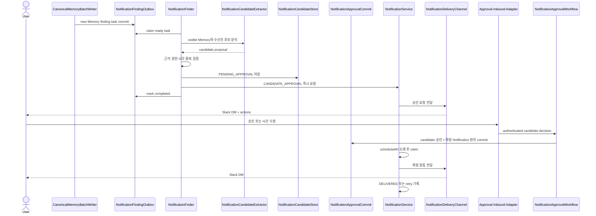

# 가족 Notification 서비스

- 상태: TODO
- 우선순위: Feature P0
- 선행 작업: 없음
- 후속 producer: 최소 가족 Task 서비스, 정기 가정 운영 Review

## 문제

Memory에 날짜와 후속 행동이 저장되어도 가족이 다시 질문하지 않으면 필요한 시점을 놓칠 수 있다.
반대로 모델이 Memory에서 찾은 내용을 곧바로 알림으로 등록하면 잘못 해석한 날짜, 불명확한 수신자,
중복 후보와 권한 누출이 실제 메시지로 이어진다.

알림 후보 발견, 사용자 승인, 확정 알림 전달을 하나의 컴포넌트가 담당하면 Codex 추론, Slack UI,
예약·재시도 상태가 결합된다. 기능별로 Slack 전송과 실패 처리를 직접 구현해도 중복과 누락이
발생한다.

## 핵심 결정

세 책임을 분리하고 의존 방향을 한쪽으로 유지한다.

1. **Notification Finder**는 새 canonical Memory에서 근거가 있는 알림 후보를 발견한다.
2. **Notification Approval Workflow**는 후보의 조회, 승인, 시간 수정, 거절을 application에서
   처리한다. Slack 버튼과 modal은 이 input port를 호출하는 inbound adapter일 뿐 승인 상태를
   소유하지 않는다.
3. **Notification Service**는 확정된 알림 요청을 durable하게 저장하고, 도래한 알림을 claim하여
   전달하고, 결과와 제한적인 retry를 관리한다.

Notification Finder와 Approval Workflow는 Notification Service를 사용한다. Notification Service는
Finder, 승인 과정, Memory 또는 Slack UI를 알지 않는다. Task와 Review도 나중에 같은 Notification
Service input port를 producer로 사용할 수 있다.

```text
canonical Memory commit
        |
        v
Notification Finder --candidate--> Approval Workflow
                                      | approve / edit
                                      v
                              Notification Service
                                      |
                                      v
                              delivery output port
                                      |
                                      v
                                  Slack DM
```

## 범위와 초기 정책

- 초기 trigger는 명확한 단일 시각의 일회성 알림만 지원한다.
- 모든 예약 시각은 명시적인 household time zone에서 `Instant`로 변환해 저장한다.
- Finder는 등록된 application user 중 source Memory를 볼 수 있는 수신자만 제안할 수 있다.
- 수신자가 하나로 확정되지 않거나 날짜·시각이 불완전하면 활성 후보를 만들지 않는다.
- 모델이 발견한 후보는 수신자가 승인해야 확정 알림이 된다.
- 이후 명시적인 자기 알림 요청은 그 요청 자체를 동의로 보고 Approval Workflow를 생략할 수 있다.
- Task 할당·완료와 Review처럼 사용자가 미리 활성화한 결정론적 producer는 후보별 승인을 요구하지
  않고 Notification Service를 직접 호출할 수 있다.
- 다른 사용자에게 의무를 부과하거나 source 열람 범위를 넓히지 않는다.

반복, 위치, 임의 조건 trigger와 사용자별 복잡한 알림 선호도는 초기 범위에 포함하지 않는다.

## 1. Notification Finder

### 책임

- 새 canonical Memory를 근거와 access scope를 포함해 읽는다.
- Codex extractor를 통해 알림 목적, 메시지, 수신자, trigger 시각과 근거 Memory ID를 구조화한다.
- extractor 결과를 결정론적으로 검증한다.
- 같은 의미의 후보를 idempotency key로 중복 생성하지 않는다.
- 검증된 후보를 저장하고 즉시 승인 요청 Notification을 생성한다.

### Memory commit 연결

Memory commit 뒤 Finder를 단순 best-effort 호출하면 프로세스 종료나 Codex 실패 때 후보가 영구히
누락된다. canonical Memory, evidence와 indexing outbox를 저장하는 transaction에
`notification_finding_outbox` 항목도 함께 기록한다.

Finder worker는 outbox 항목을 lease와 함께 claim하고 다음 순서로 처리한다.

1. 대상 Memory와 source access를 읽는다.
2. extractor에 등록 사용자 중 열람 가능한 후보 수신자만 제공한다.
3. 결과의 Memory ID, 수신자, 시각, 시간대와 evidence를 검증한다.
4. candidate와 승인 요청 Notification을 idempotent하게 저장한다.
5. 둘 다 저장된 뒤 outbox 항목을 완료한다.
6. 일시 실패는 제한적으로 재시도하고 최종 실패 원인을 남긴다.

승인 요청도 proactive message이므로 Finder가 Slack에 직접 보내지 않는다. Notification Service에
`CANDIDATE_APPROVAL` 목적의 즉시 Notification을 요청한다. 요청 payload에는 승인 문구 snapshot,
candidate ID와 adapter가 action을 렌더링하는 데 필요한 최소 정보만 포함한다.

### 후보 최소 모델

- candidate ID와 idempotency key
- source Memory ID 집합
- 제안된 수신 application user ID
- 승인 후 보낼 메시지 snapshot
- 제안된 trigger 시각과 time zone
- `PENDING_APPROVAL`, `APPROVED`, `REJECTED`, `EXPIRED` 상태
- 생성·결정·만료 시각

후보는 확정 Notification이 아니다. 거절되거나 만료된 후보는 worker가 발송 대상으로 조회하지 않는다.

## 2. Notification Approval Workflow

### application 책임

- candidate ID와 인증된 conversation identity로 승인 대상을 찾는다.
- 요청 사용자가 candidate의 제안 수신자와 같은 등록 사용자인지 확인한다.
- 이미 결정되었거나 만료된 candidate의 중복 interaction을 idempotent하게 처리한다.
- 승인, trigger 시각 수정 후 승인, 거절을 처리한다.
- 승인 시 candidate를 `APPROVED`로 바꾸고 확정 Notification을 한 transaction에서 생성한다.

승인 상태 변경과 Notification 생성 사이가 끊기면 승인됐지만 발송되지 않는 상태가 생긴다. SQLite
구현은 candidate 상태 전이와 확정 Notification insert를 원자적으로 commit하며, candidate ID에 기반한
idempotency key로 interaction 재전송을 막는다.

### inbound Slack adapter 책임

- outbound adapter가 렌더링한 승인·시간 수정·거절 action의 listener를 등록한다.
- Slack action payload의 candidate ID와 인증된 Slack identity를 application request로 변환한다.
- 시간 수정 modal을 열고 입력을 파싱하되 최종 유효성 판단은 Approval Workflow에 맡긴다.
- application result를 성공, 이미 처리됨, 만료, 권한 없음 또는 재시도 안내로 표현한다.

Slack adapter는 candidate나 승인 결과를 자체 map 또는 queue에 business state로 보관하지 않는다.

## 3. Notification Service

### 책임

- producer의 확정 Notification 요청을 idempotency key로 저장한다.
- 즉시 전달 또는 지정 시각 전달을 지원한다.
- 도래한 `PENDING` 항목을 lease와 함께 claim한다.
- 등록 사용자를 실제 delivery channel identity로 해석하는 output port를 호출한다.
- 성공, 일시 실패와 영구 실패를 기록하고 제한적으로 재시도한다.
- 취소된 Notification을 발송하지 않는다.

### 확정 Notification 최소 모델

- Notification ID와 idempotency key
- 수신 application user ID
- purpose, 메시지 snapshot과 선택적인 resource reference
- `scheduledAt`과 선택적인 `expiresAt`
- `PENDING`, `PROCESSING`, `DELIVERED`, `FAILED`, `CANCELLED` 상태
- 시도 횟수, `nextAttemptAt`, processing lease와 마지막 오류 category
- 생성·전달·취소 시각

worker는 서버 재시작 후 만료되지 않은 due Notification을 다시 처리한다. `PROCESSING` lease가 만료된
항목은 재claim할 수 있어야 한다. `expiresAt`이 지난 알림은 늦게 발송하지 않고 실패 또는 만료 사유를
기록한다.

SQLite commit과 외부 Slack 발송은 하나의 transaction으로 묶을 수 없다. 따라서 동일 Notification
생성과 동시 claim은 막되 외부 전달의 엄밀한 exactly-once를 완료 조건으로 약속하지 않는다. Slack이
메시지를 수락한 직후 결과 기록 전에 프로세스가 종료되면 retry가 중복 메시지를 만들 수 있으며,
초기 버전은 bounded at-least-once 전달과 이 잔여 위험을 명시한다.

### outbound Slack adapter 책임

- application user ID를 저장된 Slack identity로 해석해 DM을 전송한다.
- purpose와 payload를 Slack text, blocks와 action value로 렌더링한다.
- Slack API 성공 결과 또는 기술적인 오류 category만 application에 반환한다.
- 예약, retry, candidate와 승인 상태를 소유하지 않는다.

Application이 먼저 시작한 proactive 전달이므로 이 구현은 `adapter-outbound`에 둔다. 승인 button과
modal interaction 수신만 `adapter-inbound`에 둔다. 두 adapter module은 서로 의존하지 않으며 필요한
bot credential은 composition root가 각각 주입한다.

## 전체 정상 흐름



## 중요한 실패 branch

- Memory commit은 성공했지만 Finder가 실패하면 outbox가 남고 재시도한다. Memory를 롤백하지 않는다.
- extractor가 존재하지 않는 Memory, 허용되지 않은 수신자, 과거 시각 또는 불완전한 trigger를 반환하면
  candidate를 저장하지 않는다.
- 동일 Memory batch나 extractor retry는 같은 candidate를 중복 생성하지 않는다.
- 승인 요청 전달 실패는 Notification Service가 재시도하며 candidate는 `PENDING_APPROVAL`로 남는다.
- 승인 button 중복 클릭은 하나의 확정 Notification만 만든다.
- candidate 만료, 다른 사용자 interaction과 승인 후 재수정은 거절한다.
- Slack 일시 실패는 `nextAttemptAt` 이후 재시도하고 영구 실패는 기록하되 producer transaction을
  되돌리지 않는다.
- 서버 재시작 뒤 stale processing lease와 아직 유효한 예약 알림을 회수한다.

## 구현 순서

1. **Notification Service domain과 port**
   - 확정 Notification, 상태 전이, idempotency와 claim 계약을 정의한다.
   - verify: 잘못된 상태 전이, 중복 요청과 취소 후 발송을 domain/use-case test로 거절한다.
2. **SQLite 저장과 delivery worker**
   - durable 저장, due claim, lease recovery, bounded retry와 expiry를 구현한다.
   - verify: 서버 재시작, stale processing, 일시 실패와 최종 실패 test를 통과한다.
3. **Outbound Slack delivery adapter**
   - 등록 사용자 identity를 DM으로 해석하고 purpose별 메시지를 렌더링한다.
   - verify: 정상 전송, 권한·channel·rate-limit 오류 category를 application 결과로 변환한다.
4. **Approval Workflow와 candidate persistence**
   - candidate 상태와 승인·수정·거절 input port, 승인과 Notification 생성의 원자 commit을 구현한다.
   - verify: 다른 사용자 승인, 만료, 중복 click과 transaction 실패 test를 통과한다.
5. **Inbound Slack approval UI**
   - 승인·시간 수정·거절 action과 modal을 Approval Workflow에 연결한다.
   - verify: Slack payload mapping과 application result rendering test를 통과한다.
6. **Notification Finder와 Codex extractor**
   - 구조화된 proposal 계약, access·시간·근거 검증과 candidate dedup을 구현한다.
   - verify: 불완전한 날짜, 모호한 수신자, 권한 밖 수신자, 중복 후보를 저장하지 않는다.
7. **Memory commit outbox 연결**
   - canonical commit에 finding outbox를 원자적으로 추가하고 worker를 composition root에 연결한다.
   - verify: commit 후 장애, extractor 재시도와 application 재시작에도 후보가 유실·중복되지 않는다.
8. **문서와 전체 회귀 검증**
   - 각 concrete use-case leaf package README에 정상 흐름과 실패 branch의 Mermaid sequence diagram을
     추가하고 전체 test를 실행한다.

## 완료 조건

- 새 canonical Memory의 Finder 작업이 Memory와 원자적으로 기록되어 재시작 후에도 유실되지 않는다.
- Finder가 source evidence, 수신자 열람 권한과 명확한 미래 시각을 만족하는 후보만 저장한다.
- 모델이 찾은 후보는 제안 수신자의 승인 전에는 확정 알림이 되지 않는다.
- 승인·시간 수정·거절과 중복 Slack interaction이 application에서 일관되게 처리된다.
- 승인과 확정 Notification 생성 사이에 부분 성공이 없다.
- 지정 시각 Notification이 서버 재시작 후에도 처리되고 일시적인 Slack 실패가 제한적으로 재시도된다.
- Notification 생성과 claim은 중복되지 않으며 외부 전달의 at-least-once 한계가 문서화된다.
- Slack inbound/outbound adapter가 Finder, 승인과 예약 business state를 소유하지 않는다.
- Task와 Review가 Finder나 Slack UI에 의존하지 않고 Notification Service input port를 사용할 수 있다.
- 전체 test가 통과한다.

## 제외 범위

- 대화 source에서 자동으로 알림 후보를 발견하는 기능
- 반복·위치·센서·임의 조건 trigger
- 사용자가 작성하는 범용 조건식 또는 automation DSL
- SMS, 이메일, 모바일 push 등 Slack 이외의 delivery channel
- 사용자별 복잡한 방해 금지 시간, 우선순위와 escalation 정책
- unresolved 수신자나 불완전한 시각을 위한 장기 clarification workflow
- Notification을 별도의 canonical Memory로 자동 저장하는 동작
