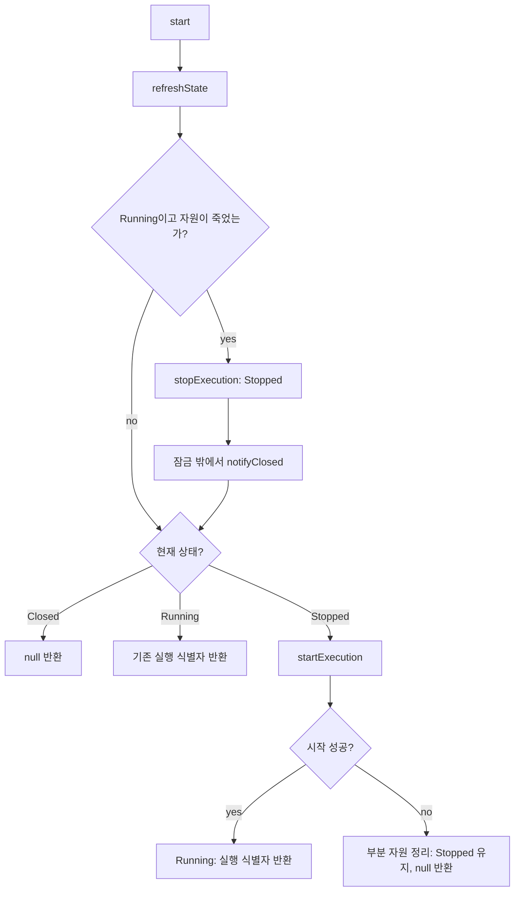

# RPC lifecycle

아직 wiring하지 않은 구현이다. 기존 `rpcclient.CodexRpcClientFactory`와 호출부는 원래 구현을 사용한다.

## 코드 읽는 순서

`AbstractCodexRpcClient`의 public 메서드는 모두 final이다. 현재 상태와 조건을 확인한 뒤 작업을 선택한다.

| 현재 상태 | 호출 / 조건 | 수행 | 다음 상태 |
| --- | --- | --- | --- |
| Stopped | start | startExecution | 성공하면 Running, 실패하면 Stopped |
| Running | start / isResourceAlive = true | 기존 실행 식별자 반환 | Running |
| Running | start / isResourceAlive = false | refreshState에서 stopExecution → notifyClosed, 이후 시작 | Stopped → Running |
| Running | send / 실행 식별자 일치, 자원 생존 | writeMessage | 성공하면 유지, 실패하면 종료 처리 |
| Running | EOF 또는 I/O 실패 / 현재 실행인가? | onUnexpectedlyClosed → stopExecution → notifyClosed | Stopped |
| Running | stop | stopExecution | Stopped |
| 모든 상태 | close | 실행 중이면 stopExecution, reader executor 종료 | Closed |
| Stopped / Closed | stop | 아무 작업 없음 | 유지 |
| Closed | start / send | null 반환 / 예외 | Closed |

`isCurrentExecution`과 `isResourceAlive`는 판단, `startExecution`과 `stopExecution`은 전이, `openResource`·`writeMessage`·`readMessages`·`readDiagnostics`·`releaseResource`는 I/O 작업이다. 구체 클래스는 I/O와 자원 생존 확인만 구현한다.

## 동시 호출 계약

시작과 자원 정리를 포함한 상태 전이는 하나의 잠금으로 직렬화한다. 별도의 Starting·Stopping 상태나 시작 취소·예약·게시 절차는 없다. 시작 중 stop/close가 오면 시작 완료를 기다린 뒤 정리한다. 따라서 프로세스 생성이나 정리가 오래 걸리면 다른 수명주기 호출도 기다린다.

송신은 실행별 송신 잠금만 잡고 실제 쓰기를 수행한다. stop/close는 이 잠금을 기다리지 않고 프로세스를 종료할 수 있다. 이미 승인된 송신은 종료와 겹치면 성공하거나 실패할 수 있으며, 새 실행으로 전달되거나 자동 재전송되지는 않는다. 실패했어도 일부 바이트는 전달됐을 수 있다.

콜백은 두 잠금 밖에서 실행한다. EOF·실패·명시적 종료 중 먼저 상태를 바꾼 경로만 정리 책임을 가진다. 명시적 종료가 먼저라면 종료 알림을 보내지 않는다. 예상하지 못한 종료가 먼저라면 알림은 한 번 전달되며, 그 전에 다른 호출이 재시작할 수도 있다. refreshState 이후 start도 현재 상태를 기준으로 판단하므로, 콜백에서 재시작하거나 close해도 그 결과를 따른다.

## I/O와 실패 계약

- openResource 실패 시 반환하지 못한 부분 자원은 구현체가 정리한다. reader 등록 실패도 자원을 정리하고 null을 반환하며, 성공하지 않은 시작에는 종료 알림을 보내지 않는다.
- stdout EOF는 프로세스가 살아 있어도 RPC 실행 종료로 취급한다. stderr의 정상 EOF만으로는 종료하지 않는다.
- releaseResource는 다른 reader 작업의 완료나 사용자 콜백을 기다리면 안 된다. reader는 상태 잠금을 기다리고 있을 수 있다.
- stdio 정리는 자식 프로세스와 본 프로세스를 종료한 뒤 writer를 닫는다. 본 프로세스 종료 확인은 최대 5초 기다린다. 스트림 close에는 별도 제한 시간이 없으며, 정리 실패는 기록하고 나머지 정리를 시도한다.
- send는 실행 식별자가 다르거나 실행 중이 아니면 IllegalStateException, 쓰기 실패 시 해당 예외를 전달한다. stop/close는 반복 호출해도 안전하다. 정리·콜백 예외는 기록하며 수명주기 진행을 막지 않는다.

## 다음 wiring에서 사용할 계약

start는 실행마다 다른 RpcSession을 반환하고, 같은 실행을 재사용하면 기존 식별자와 콜백을 유지한다. send는 이 식별자를 요구한다. onMessage와 onClosed도 식별자를 인자로 받는다. 이미 승인된 콜백은 stop 또는 재시작 뒤에 도착할 수 있다.

콜백은 start 반환 전에도 실행될 수 있으므로, 호출부는 start 호출 전에 해당 시도의 콜백 수신 정보를 준비해야 한다. 콜백으로 받은 식별자와 반환된 식별자를 연결하고, 이전 실행의 이벤트가 새 실행의 초기화 상태나 대기 요청을 지우지 않게 해야 한다. 이 사용처 변경은 아직 하지 않았다.

## 검증

`gradlew.bat :integration-codex:test --tests "com.homeassistant.codex.rpcclient.lifecycle.*"`

가짜 I/O로 시작·종료 직렬화, 중복 정리 방지, 늦은 EOF·송신 실패, 콜백 재진입을 검증한다. 별도의 Java 테스트 프로세스로 UTF-8 왕복 송수신, 살아 있는 프로세스의 stdout EOF, stdin을 읽지 않는 프로세스 종료를 확인한다. Codex나 운영 서비스는 실행하지 않는다.
